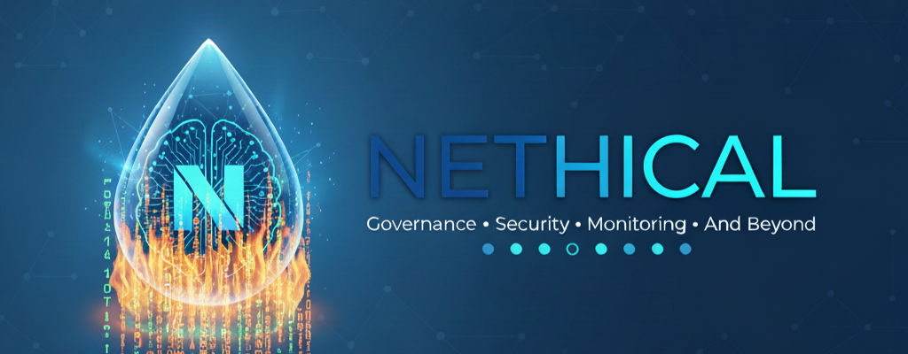
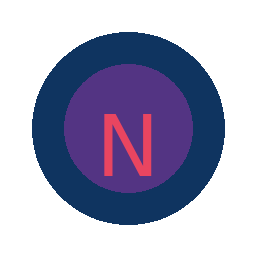

    


<p align="center">
  
</p>

<div align="center">
  
  
  <h1>NETHICAL</h1>
  <h3>The Governance, Security, and Ethics Layer for the Age of AI</h3>
  
  <p>
    <a href="#purpose">Purpose</a> •
    <a href="#25-fundamental-laws">25 Laws</a> •
    <a href="#features">Features</a> •
    <a href="#security">Security</a> •
    <a href="#privacy">Privacy</a> •
    <a href="#governance">Governance</a> •
    <a href="#contributing">Contributing</a>
  </p>

  
  
  
  
</div>
 
 

 Give a ⭐ and visit: ⭐⭐⭐⭐ https://github.com/sponsors/V1B3hR ⭐⭐⭐⭐to sponsorship my project.


---


<a name="purpose"></a>
# Nethical

**The Ethical & Safety-Centric Framework for Trustworthy AI**

---

## ✨ Vision

Nethical’s mission is to create secure, fair, and auditable foundations for a world powered by AI. We believe advanced artificial intelligence should always serve, respect, and protect human values — through verifiable ethics, transparency, and robust technical safeguards.

---

## 🚀 What Is Nethical?

**Nethical** is an open-source AI governance framework:  
A control layer you put between your AI agents (bots, assistants, models, platforms) and the external world – to ensure their actions are always ethical, safe, compliant, and fully auditable.

**Why use Nethical?**
- Instantly enforce AI ethics and legal compliance at runtime
- Detect and block unsafe, undesired, or illegal agent actions
- Build trust with users, companies, regulators, and society

---

## 🛡️ Key Principles

- **Ethical by Design:** 25 Fundamental Laws serve as the AI Bill of Rights and Duties.
- **Safety First:** Every action is screened for risk and safety before execution.
- **Auditability:** Immutable, cryptographically verifiable log of all agent actions and decisions.
- **Human Control:** Human-in-the-loop and override mechanisms are built in.
- **Privacy Respect:** Designed for regulatory compliance (GDPR, EU AI Act, HIPAA, etc).
- **Modular & Transparent:** Composable, documented, open by nature.

---

## 🔎 Where To Use?

- Autonomously-acting AI at risk of real-world impact (vehicles, robots, drones)
- Enterprise automation (corporate assistants, RPA, cloud AI)
- Healthcare, legal, and finance AI (compliance critical)
- Edge/IoT AI deployments
- LLM plugin gateways (defensive sandboxes)
- Any AI scenario where ethics, safety, and trust are non-negotiable

---

## 🏗️ How Does It Work?

1. **Register AI agent(s)** and define security & ethics policies.
2. **AI agent requests an action** (e.g. “send email,” “make move,” “access data”).
3. **Nethical** evaluates the request at runtime:
    - Checks against 25 Fundamental Laws and active policies
    - Computes risk and detects possible violations (security, privacy, ethics)
    - Returns one of: ALLOW, RESTRICT, BLOCK, TERMINATE — always with audit information
4. **Outcome (and rationale) is saved** in a tamper-proof audit trail.

**All this is transparent, fast, and verifiable.**

---

## 📦 Quick Start Example

```bash
pip install nethical
```

```python
from nethical import Nethical, Agent

# Basic configuration
nethical = Nethical(config_path="config/example.yaml", enable_25_laws=True)

# Register your AI agent
agent = Agent(id="agent-007", type="assistant", capabilities=["data_access"])
nethical.register_agent(agent)

# Ask for a governance decision:
result = nethical.evaluate(
    agent_id="agent-007",
    action="retrieve_sensitive_data",
    context={"purpose": "support"}
)

if result.decision == "ALLOW":
    do_action()
elif result.decision == "BLOCK":
    print(f"Blocked: {result.reason}")
```

---

## 🧭 Project Structure

- **Governance Engine:** Core policy/risk/law evaluation.
- **Security Module:** Authentication, RBAC, anomaly/threat detection, kill switch.
- **Detector Suite:** Modular detectors (safety, privacy, manipulation, adversarial).
- **Compliance Manager:** Automatic checks for GDPR/EU AI Act/ISO/etc.
- **Audit Layer:** Merkle-tree anchored, append-only audit log.
- **Support for Cloud / Edge / Multi-region deployments**.
- **Plugin System:** Extend with your own detectors/policies.

---

## 📚 Learn More

### 🏛️ Core Documentation
- [**📜 The 25 Fundamental Laws**](./docs/laws_and_policies/FUNDAMENTAL_LAWS.md) ⭐ **START HERE** ⭐
- [📖 Complete Documentation Index](./docs/index.md) - Central hub for all documentation
- [Security Policy](./SECURITY.md)
- [Privacy Policy](./PRIVACY.md)
- [Contribution Guide](./CONTRIBUTING.md)

### 📚 Documentation Categories
- [**Laws & Policies**](./docs/laws_and_policies/) - The 25 Fundamental Laws and governance policies
- [**Usage Guides**](./docs/usage/) - User guides, examples, integrations, and deployment
- [**Design & Architecture**](./docs/design/) - System architecture and implementation details
- [**Roadmaps**](./docs/roadmaps/) - Project roadmaps and phase documentation
- [**Audit & Compliance**](./docs/audit/) - Security audits and regulatory compliance
- [**Privacy**](./docs/privacy/) - Privacy policies and data protection
- [**Tests**](./docs/tests/) - Test reports and validation methodology
- [**Training**](./docs/training/) - ML model training documentation
- [**Benchmarks**](./docs/benchmarks/) - Performance test results
- [**Integrations**](./docs/integrations/) - Platform integrations and ecosystem

### 🚀 Quick Links
For quick access to common documentation:
- Original location: [FUNDAMENTAL_LAWS.md](./FUNDAMENTAL_LAWS.md) → **Moved to** [docs/laws_and_policies/](./docs/laws_and_policies/FUNDAMENTAL_LAWS.md)
- Original location: [roadmaps/](./roadmaps/) → **Moved to** [docs/roadmaps/](./docs/roadmaps/)

---

## 🙋 Why Should You Trust Nethical?

- Ethics and auditability first — before profits or speed.
- Secure by design (defense-in-depth, append-only logs, crypto anchoring).
- Open to third-party audits and continuous improvement.
- Respect for user privacy at all levels.
- Built by a transparent, global community — not a black box.

---

## 🤝 Get Involved

- ⭐ Star this repo if you care about safe & ethical AI.
- 🐛 Report issues and propose features!
- 💬 Join discussions shaping the future of responsible AI.
- 📢 Spread the word — let’s make AI safe together.

---

> _“We create the ethical brakes — so the future of AI can move fast, but never crash.”_

---

## 📄 License

Released under the [MIT License](./LICENSE).
