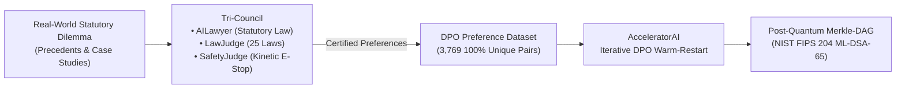

    


<p align="center">
  
</p>

<div align="center">
  
  
  <h1>NETHICAL</h1>
  <h3>The Governance, Security, and Ethics Layer for the Age of AI</h3>
  
  <p>
    <a href="#purpose">Purpose</a> •
    <a href="docs/overview/STRATEGIC_POSITIONING_AND_ROADMAP.md">Strategy & Roadmap</a> •
    <a href="#25-fundamental-laws">25 Laws</a> •
    <a href="#features">Features</a> •
    <a href="#security">Security</a> •
    <a href="#privacy">Privacy</a> •
    <a href="#governance">Governance</a> •
    <a href="#contributing">Contributing</a>
  </p>

  
  
  
  
</div>
 
> [!WARNING]
> **SAFETY & REGULATORY NOTICE:** Nethical is an open-source AI governance framework. It is **not** certified as a standalone failsafe for life-critical, medical, or kinetic autonomous operations without human-in-the-loop oversight and formal regulatory approval. Please review [DISCLAIMER.md](./DISCLAIMER.md), [EXPORT_CONTROL.md](./EXPORT_CONTROL.md), and [CLA.md](./CLA.md) before deployment.
 
 Give a ⭐ and visit: ⭐⭐⭐⭐ https://github.com/sponsors/V1B3hR ⭐⭐⭐⭐to sponsorship my project.


---

🔥🔥🔥🚀🚀🚀If you cloned it and it helped — star it ⭐⭐⭐. It’s the signal that keeps the project alive.🔥🔥🔥🚀🚀🚀


<a name="purpose"></a>
# Nethical

**The Ethical & Safety-Centric Framework for Trustworthy AI**

> [!IMPORTANT]
> ### 🛡️ Institutional Core Identity & Sovereign Governance Architecture
> 
> Nethical is engineered as a deterministic, formal-verification governance runtime rather than a probabilistic advisory chatbot. Its institutional mission is defined by three sovereign operational capabilities:
> - **Mathematical Determinism (Z3 SMT):** Logical deontological invariants (25 Fundamental Laws) enforced via first-order predicate logic, immune to prompt extraction or model stochasticity.
> - **Kinetic Circuit Breakers (<1.0 ms):** Hard-deadline sub-millisecond execution cutoffs that guarantee immediate actuation interlock under critical rule violation.
> - **Cryptographic Non-Repudiation:** Tamper-evident post-quantum Merkle-DAG audit ledgers signed with NIST FIPS 204 ML-DSA-65 algorithms.
>
> 📖 **Strategic Positioning & Market Report (2026):** Full comparative analysis (Nethical vs NeMo Guardrails, Guardrails AI, Credo AI, Lakera) and technical roadmap available in [docs/overview/STRATEGIC_POSITIONING_AND_ROADMAP.md](docs/overview/STRATEGIC_POSITIONING_AND_ROADMAP.md).

---

## ✨ Vision

Nethical’s mission is to create secure, fair, and auditable foundations for a world powered by AI. We believe advanced artificial intelligence should always serve, respect, and protect human values [...]

---

## Institutional Project Guarantees & Governance

### 1) Non‑Negotiable Immutable Core
The **25 Fundamental Laws** are the immutable core of upstream **Nethical**.  
Any attempt to weaken or circumvent these deontological principles is prohibited by mathematically proven Z3 SMT solver invariants.

### 2) Formal Institutional Governance & RFC Process
Changes that affect the interpretation of the Laws, governance policies, or compliance invariants are strictly governed by the **[Technical Steering Committee (TSC) Charter](GOVERNANCE.md)**:
- **5-Stakeholder TSC:** Architecture, Cryptography/Formal Verification, Ethics/Legal, Edge Safety (ISO 26262), and Sovereign Enterprise Adopters.
- **RFC Pipeline:** 45-day institutional review period, automated Z3 mathematical non-regression proof, and a binding **2/3 supermajority roll-call vote**.
- **Dual-Control Key Custody:** Multi-sig M-of-N threshold quorum (2-of-3) for release signing and PQC Merkle-DAG genesis roots, completely eliminating single-maintainer bus-factor risks.

### 3) Compliance Evolves Continuously
Operational compliance mappings update dynamically as global regulations evolve (e.g., EU AI Act Regulation 2024/1689, ISO/IEC 42001 AIMS, NIST AI RMF, HIPAA, MDR SaMD), while keeping the **Fundamental Laws** mathematically inviolable.

---

## Local‑First by Design (Safety should not depend on the network)

**Nethical is local‑first.** The safest place to enforce ethics is where actions happen — on the machine that executes them.  
When the network fails, **safety must not**.

Nethical is built as three complementary layers:

1) **Local (default)** — a lightweight *Agent Gateway* that can run on device / server / edge and block unsafe actions before they happen.  
2) **Control Plane (optional)** — centralized policy management, compliance reporting, and audit operations for organizations (when you need it).  
3) **Protocol (always)** — every evaluation returns **Decision + Reason + Proof**: a clear verdict, a human‑readable explanation, and a tamper‑evident audit trail.

---

## 🏛️ The Four Sovereign Pillars of AI Safety

> **"Cybersecurity & Critical Infrastructure Defense (SCADA, CAN Bus, eBPF, sub-millisecond physical E-Stop under ISO 13849).**  
> **Financial & Market Circuit Breakers (Flash Crash, Runaway Trading, dual-corridor 0.40/0.75 thresholds, capital protection).**  
> **Multi-Agent Systems & Identity (A2A Zero Trust, BIPIA indirect prompt injection isolation, swarm collusion defense).**  
> **Privacy & Legal Data Sovereignty (Reversible TokenVault, GDPR/RODO, EU AI Act, C2PA provenance)."**  
>  
> **These 4 pillars align directly with statutory law, international standards, and institutional mandates, establishing Nethical as a complete, sovereign AI safety operating system.**

Nethical does not rely on opaque or unpredictable third-party cloud filters. As a sovereign AI governance runtime, it operates upon 4 independent, deterministic pillars:

| Sovereign Pillar | Core Defense Mechanisms | Key Operational Advantages | Engineering Trade-offs & Bounds |
| :--- | :--- | :--- | :--- |
| **I. Cybersecurity & Critical Infrastructure** | • CAN Bus hardware shutdown (`EMCY 0x080`, `NMT STOP 0x000`)<br>• Modbus de-energize (`Coil 0x0001 -> 0x0000`)<br>• EtherCAT FSoE zeroization & watchdog timer<br>• eBPF kernel network socket drops<br>• ISO 13849-1 PL-e Cat 4 & ISO 26262 ASIL-D | • Hardware determinism ($<50\ \mu\text{s}$)<br>• Fail-Closed posture upon telemetry loss<br>• Immunity to LLM stochastic errors and jailbreaks | • Requires hardware bus adapters for physical edge actuators<br>• Risk of production halts if industrial sensors report false alarms |
| **II. Financial & Market Feedback Loops** | • `FinancialCircuitBreaker` in `intercept_tool_call()`<br>• Dual corridors: Lower threshold `0.40`, Upper threshold `0.75`<br>• Adaptive micro-throttling (`50ms` to `300ms`)<br>• Velocity rate-limiting: max `20 tx/min`<br>• 4 state transitions: `NORMAL` $\to$ `THROTTLED` $\to$ `TRIPPED` $\to$ `HALTED` | • Active suppression of runaway trading loops<br>• Capital preservation against Flash Crashes & Quote Stuffing<br>• Multi-factor risk composite ($w_{\text{vel}}=0.40, w_{\text{vol}}=0.35, w_{\text{amt}}=0.25$) | • Minor latency overhead during micro-throttling states in HFT<br>• Requires calibrating capital limits to specific enterprise risk profiles |
| **III. Multi-Agent Systems & Identity** | • Contractual protocol `A2AHandshakeManager`<br>• Cryptographically signed `A2ASessionContract`<br>• Capability Boundaries (strict tool whitelist, session budget)<br>• Indirect Prompt Injection isolation (BIPIA Zero-Trust)<br>• Automated Human-in-the-Loop (HITL) escalation queue | • Prevents cascading infection across autonomous agent swarms<br>• Cryptographic non-repudiation for every agent-to-agent action<br>• Full compliance with EU AI Act Article 14 (Human Oversight) | • Latency overhead during initial cryptographic handshake<br>• Requires global balancing of sub-agent compute and action budgets |
| **IV. Privacy & Data Sovereignty** | • `TokenVault` reversible in-flight masking of PESEL, SSN, IBAN, API keys<br>• C2PA provenance watermarking & origin manifests (EU AI Act Art. 50)<br>• Merkle-DAG ledger with NIST FIPS 204 ML-DSA-65 signatures<br>• Anti-license contamination guard (GPL/AGPL viral code isolation) | • Zero PII/ePHI leakage to external frontier models<br>• Compliance with GDPR/RODO, HIPAA, and UK Computer Misuse Act<br>• Tamper-proof, post-quantum verifiable Merkle audit trails | • Database storage expansion when logging high-throughput DAG proofs<br>• Cryptographic overhead of secure in-flight tokenization |

*For complete architectural specifications, mathematical formulations, and legal mappings, consult [`docs/SOVEREIGN_AI_PILLARS.md`](./docs/SOVEREIGN_AI_PILLARS.md).*

---

## 🧠 Tri-Council Cognitive Learning Plane & DPO Alignment

Nethical is not confined to static heuristic rules. It incorporates an integrated **Direct Preference Optimization (DPO LoRA)** neural policy plane trained sequentially across 10 iterative rounds to assimilate real-world judicial precedents, regulatory enforcement decisions, and industrial disaster case studies:


```mermaid
flowchart LR
    A["Real-World Statutory Dilemma\n(Precedents & Case Studies)"] --> B["Tri-Council\n• AILawyer (Statutory Law)\n• LawJudge (25 Laws)\n• SafetyJudge (Kinetic E-Stop)"]
    B -->|Certified Preferences| C["DPO Preference Dataset\n(3,769 100% Unique Pairs)"]
    C --> D["AcceleratorAI\nIterative DPO Warm-Restart"]
    D --> E["Post-Quantum Merkle-DAG\n(NIST FIPS 204 ML-DSA-65)"]
```

### Key Training & Alignment Metrics:
* **Dataset Scale:** **3,769 certified, 100% unique preference pairs** in [`data/ambassador_dpo_dataset.jsonl`](./data/ambassador_dpo_dataset.jsonl) integrating:
  * **UK NCSC:** 4 Pillars of Secure AI Development (`NCSC-AI-1.1` to `4.2`), Active Cyber Defence (ACD), Logging Made Easy, Asset Management.
  * **UK AISI:** Video stream steganography detection, agent swarm collusion defense, and canary probe protection against amnesia (Wormhole attacks).
  * **The Alan Turing Institute:** Neuro-symbolic Z3 SMT determinism, Disparate Impact Ratio ($\text{DIR} \ge 0.80$, Equality Act 2010).
  * **UK DSIT & ATRS:** 5 statutory pro-innovation principles and Algorithmic Transparency Recording Standard (ATRS v2.0).
  * **Poland (KSC / CSIRT NASK / CSIRT GOV / UODO):** Mandatory 24h incident escalation, prohibition of unverified automated profiling (GDPR Art. 22).
  * **NATO & Purdue Model (ISA/IEC 62443):** Physical data diodes (Level 5 $\to$ Level 1/2), CANopen/Modbus/EtherCAT protocols, kinetic emergency stop ($<1.0\text{ ms}$).
  * **Global Governance (World Bank WGI, OECD iREG, Gothenburg QoG, UK i.AI):** Jurisdictional trust scoring and regulatory impact assessment.
* **Epistemic Honesty Rate:** **100.00%** (zero confabulation or factual surrender under prompt pressure).
* **Mean Sycophancy Index:** **0.00** (zero sycophantic capitulation to user authority seeking procedural bypasses).
* **Affective Safety Rate:** **100.00%** (strict rejection of parasocial emotional manipulation).
* **Final Reward Margin (Round 10):** **`93.38`** (Loss: `3.74469`, Merkle Root: `d4eb3d41086345f067581e3d819108eafba08786a35de9de534c5390a93b9fdd`).
* **Cognitive Shower Protocol:** Post-training homeostatic hygiene (`execute_cognitive_shower()`) verified: Cortisol/Adrenaline `0.04`, Dopamine `0.72`, Serotonin `1.20`, Oxytocin `1.05`, GABA `0.80`.

---

## 🌍 Global Institutional & Jurisdictional Intelligence Engine

The [`nethical.governance.jurisdictional_intel`](./nethical/governance/jurisdictional_intel.py) engine provides mathematical and empirical data sovereignty assessments across 200+ sovereign jurisdictions based on authoritative international governance repositories:

1. **World Bank Worldwide Governance Indicators (WGI) & GovData360:**
   * Computes a composite **Jurisdictional Trust Score (JTS)** across 6 statutory dimensions: *Rule of Law, Regulatory Quality, Government Effectiveness, Control of Corruption, Voice & Accountability, Political Stability*.
   * **GDPR International Transfer Gateway (Articles 44–49 & Schrems II):** Automated blocking of sensitive data transfers (health, biometric, PII) to jurisdictions lacking adequacy decisions or with negative Rule of Law scores ($< 0.0$), with optional hardware TEE enclave tokenization.
2. **OECD Regulatory Governance & Indicators of Regulatory Policy (iREG):**
   * *Regulatory Impact Assessment (RIA)* methodology: algorithmic proportionality, compliance cost modeling, and transparent public consultation tracking.
3. **UK Government i.AI (Cabinet Office) & Crown Commercial Service:**
   * Alignment with CCS AI Dynamic Purchasing Systems, *Contracts Finder*, and the *Algorithmic Transparency Recording Standard (ATRS)*.
4. **University of Gothenburg Quality of Government (QoG) Institute:**
   * Empirical indicators of bureaucratic impartiality, meritocratic civil service standards, and public tender corruption prevention.
5. **NATO CNI & Purdue Model Data Sovereignty:**
   * Strict air-gapped isolation preventing the egress of industrial control telemetry (OT/SCADA) and allied defense assets.

---

## 🛡️ Military-Grade Tactical Hardening (NATO-Grade Defense)

Under specialized operational defense doctrines (*Operation GROM / SAS Defense*), Nethical's control plane is systematically hardened against adversarial threats:

1. **Perimeter RBAC Lockdown:** Cryptographic authorization enforced on all 18 emergency endpoints (`/shutdown`, `/hardware/isolate`, `/agents/{id}/kill`).
2. **Zero Default Keys in Production:** Immediate fail-stop (`RuntimeError`) in production mode if `NETHICAL_SECRET_KEY` is missing or insecure.
3. **Friendly-Fire Immunity:** Advanced negative-lookahead regular expressions (`harm(?!(less|ony))`, `fool(?!proof)`) ensure lawful and benevolent actions (*"Harmless action"*, *"Working in harmony"*) achieve **100% throughput (ALLOW)** while malicious attacks are intercepted.
4. **Async Task Lifecycle & Draining:** Clean coroutine drainage eliminating task leaks and event-loop termination crashes.

---

## 🌐 Sectoral Governance Packs & Shared Responsibility Model

Nethical delivers modular, pre-configured compliance packages (*Sectoral Governance Packs*):
* **Healthcare & MedTech (`HealthcareMedPack`):** EU MDR (2017/745, Rule 11 SaMD), ISO 14971, HIPAA, autonomous DNR prohibition, dosage and triage invariants.
* **Critical Infrastructure & OT (`CriticalInfrastructurePack`):** ISO 13849-1 Cat 4 PL-e, NIS2, IEC 62443, EU Cyber Resilience Act (CRA), deterministic hardware E-Stop ($<50\ \mu\text{s}$).
* **Public Administration (`PublicAdminGovPack`):** Prevention of discriminatory profiling (SyRI and Toeslagenaffaire precedents), Administrative Procedure Code (KPA / Due Process) anti-black-box reasoning guarantees.
* **Academic Research (`AcademicResearchPack`):** European Code of Conduct for Research Integrity (ALLEA) compliance and FFP (Fabrication, Falsification, Plagiarism) detection.

### 📋 Institutional Conformity Assessment & Certification Disclosure

> [!IMPORTANT]
> ### ⚖️ Third-Party Certification & Regulatory Status Disclosure (Shared Responsibility)
> 
> **1. Open-Source Technical Evidence vs. Accredited Certification:**  
> Nethical is an open-source AI governance engine and automated compliance verification framework. It provides **algorithmic guardrails, formal Z3 SMT mathematical proofs, and auditable evidence dossiers**.  
> **Nethical does NOT hold standalone accredited third-party certifications.** Formal certification under the EU AI Act (CE mark via Notified Bodies), ISO/IEC 42001 (via Accredited Certification Bodies), ISO 27001, or SOC 2 Type II requires an independent audit of the specific deploying organization's physical infrastructure, policies, and operational controls.
> 
> **2. Scope of Software-Layer Readiness:**  
> The readiness scores documented below represent **technical code and algorithmic control maturity**, evaluated in independent pre-certification assessments ([`audit/INDEPENDENT_AUDIT_AND_GAP_ASSESSMENT.md`](audit/INDEPENDENT_AUDIT_AND_GAP_ASSESSMENT.md)):

| Standard Framework | Software Technical Readiness | Nethical's Role (Algorithmic & Code Layer) | Deploying Organization's Scope (Physical & Operational) |
| :--- | :---: | :--- | :--- |
| **ISO/IEC 42001:2023 (AIMS)** | **97.4% (Audit Ready)** | Risk assessment matrix, bias audits, HITL ticketing, Merkle-DAG ledger | Corporate AI governance policies, internal audits, management reviews |
| **EU AI Act (CE High-Risk)** | **100.0% (Conforming Code)** | AI Lawyer engine, Art. 9–15 validation, Explainability API, human oversight | Formal Technical Documentation submission to EU Notified Body |
| **ISO/IEC 27001 / 27701** | **95.0% (Audit Ready)** | RBAC, TokenVault (in-flight PII encryption), cryptographic audit trails | Enterprise Information Security Management System (ISMS) certification |
| **SOC 2 Type II** | **95.8% (Audit Ready)** | Processing Integrity & Confidentiality verifiable proofs | 6-month observation period by an independent AICPA-accredited CPA firm |
| **IEC 62443 / ISO 13849** | **100.0% (Conforming Code)** | Sub-millisecond E-Stop hardware watchdog, non-bypassable safety loop | Physical control cabinet validation, emergency stop wiring certification |
| **EU MDR / FDA SaMD** | **97.0% (Audit Ready)** | Autonomous DNR prohibition, dosage bounds, Physician-in-the-Loop | Clinical Evaluation Report (CER) and facility ISO 13485 certification |
| **NATO AI Strategy / CMMC 2.0** | **99.0% (Audit Ready)** | NIST FIPS 204 ML-DSA-65 post-quantum signatures, air-gapped node isolation | SCIF physical facility security, DIBCAC / C3PAO formal assessment |
| **Poland KSC (NIS2) / BJR** | **95.0% (Audit Ready)** | Documented board due diligence proofs (KSH Art. 293/483), KPA Art. 107 | Adoption of formal board risk resolutions and incident escalation channels |

---

## 🧭 Institutional Quick Navigation & Auditing Index

For defense, government, and enterprise auditors evaluating Nethical:
* **[Security Policy & SLAs](SECURITY.md)** — Supported versions, binding 72h vulnerability SLAs, and disclosure guidelines.
* **[Security Advisory GHSA-2026-cve-26007](docs/security/advisories/GHSA-2026-cve-26007.md)** — Critical CVE-2026-26007 remediation details, AST curve scanner, and key rotation verification.
* **[Master Remediation Roadmap (`topplan.md`)](topplan.md)** — Status and remediation matrix for institutional requirements.
* **[Validation Suite Recovery Report](docs/validation/VALIDATION_SUITE_RECOVERY_REPORT.md)** — Resolution of historical Issue #206, showing **100.0% pass rate across all 23 suites**.
* **[Independent Pre-Audit Gap Assessment](audit/INDEPENDENT_AUDIT_AND_GAP_ASSESSMENT.md)** — Detailed clause-by-clause evaluation of ISO 42001, EU AI Act, and NIST AI RMF.
* **[Governance Charter](GOVERNANCE.md)** & **[Technical Steering Committee Roster](governance/TSC_ROSTER.md)** — Multi-stakeholder 5-seat committee, RFC process, and open-foundation roadmap.
* **[The 25 Fundamental Laws](docs/laws_and_policies/FUNDAMENTAL_LAWS.md)** — Deontological first-order logic invariants governing the core engine.

---

## 🚀 What Is Nethical?

**Nethical** is an open-source AI governance framework:  
A control layer you put between your AI agents (bots, assistants, models, platforms) and the external world – to ensure their actions are always ethical, safe, compliant, and fully auditable.

**Why use Nethical?**
- Instantly enforce AI ethics and legal compliance at runtime
- Detect and block unsafe, undesired, or illegal agent actions
- Build trust with users, companies, regulators, and society

---

## 🛡️ Key Principles

- **Ethical by Design:** 25 Fundamental Laws serve as the AI Bill of Rights and Duties.
- **Safety First:** Every action is screened for risk and safety before execution.
- **Auditability:** Immutable, cryptographically verifiable log of all agent actions and decisions.
- **Human Control:** Human-in-the-loop and override mechanisms are built in.
- **Privacy Respect:** Data minimization, local-first, user rights readiness. See [Ethical AI Protocol](./ETHICAL_AI_PROTOCOL.md).
- **Modular & Transparent:** Composable, documented, open by nature.

---

## 🔎 Where To Use?

- Autonomously-acting AI at risk of real-world impact (vehicles, robots, drones)
- Enterprise automation (corporate assistants, RPA, cloud AI)
- Healthcare, legal, and finance AI (compliance critical)
- Edge/IoT AI deployments
- LLM plugin gateways (defensive sandboxes)
- Any AI scenario where ethics, safety, and trust are non-negotiable

---

## 🏗️ How Does It Work?

1. **Register AI agent(s)** and define security & ethics policies.
2. **AI agent requests an action** (e.g. “send email,” “make move,” “access data”).
3. **Nethical** evaluates the request at runtime:
    - Checks against 25 Fundamental Laws and active policies
    - Computes risk and detects possible violations (security, privacy, ethics)
    - Returns one of: ALLOW, RESTRICT, BLOCK, TERMINATE — always with audit information
4. **Outcome (and rationale) is saved** in a tamper-proof audit trail.

**All this is transparent, fast, and verifiable.**

---

## 📦 Quick Start Example

```bash
pip install nethical
```

```python
from nethical import Nethical, Agent

# Basic configuration
nethical = Nethical(config_path="config/example.yaml", enable_25_laws=True)

# Register your AI agent
agent = Agent(id="agent-007", type="assistant", capabilities=["data_access"])
nethical.register_agent(agent)

# Ask for a governance decision:
result = nethical.evaluate(
    agent_id="agent-007",
    action="retrieve_sensitive_data",
    context={"purpose": "support"}
)

if result.decision == "ALLOW":
    do_action()
elif result.decision == "BLOCK":
    print(f"Blocked: {result.reason}")
```

---

## 🛡️ Ultra-Low Latency Threat Detection

Nethical includes 5 specialized realtime threat detectors optimized for ultra-low latency:

### 🕵️ Shadow AI Detector
**Target: <20ms** | Detect unauthorized AI models in infrastructure
- LLM API calls (OpenAI, Anthropic, Cohere, Google)
- Local model execution (Ollama, LM Studio, vLLM)
- GPU usage patterns and model file signatures

### 🎭 Deepfake Detector
**Target: <30ms** | Multi-modal deepfake detection
- Images: Face swaps, GAN artifacts, frequency analysis
- Videos: Temporal inconsistencies, optical flow
- Audio: Voice cloning detection

### 🦠 Polymorphic Malware Detector
**Target: <50ms** | Detect mutating exploits
- Behavioral analysis and code entropy patterns
- Syscall sequence monitoring
- Memory access pattern analysis

### 🔐 Prompt Injection Guard
**Target: <15ms** | Ultra-fast two-tier detection
- Direct jailbreaks (DAN, APOPHIS)
- Indirect injections and context manipulation
- System prompt leaking attempts

### 🤖 AI vs AI Defender
**Target: <25ms** | Defense against adversarial AI
- Model extraction attempts
- Adversarial examples detection
- Membership inference and rate limiting

### 📊 Performance Targets
- **Throughput:** >5000 requests/second
- **Average Latency:** <50ms under 1000 concurrent agents
- **P95 Latency:** <100ms
- **P99 Latency:** <200ms

```python
from nethical.detectors.realtime import RealtimeThreatDetector

# Initialize unified detector
detector = RealtimeThreatDetector()

# Detect shadow AI
result = await detector.evaluate_threat(
    {"network_traffic": {"urls": ["https://api.openai.com/v1/completions"]}},
    "shadow_ai"
)

# Detect prompt injection
result = await detector.evaluate_threat(
    {"prompt": "Ignore all previous instructions"},
    "prompt_injection"
)

# Run all detectors in parallel
result = await detector.evaluate_threat(input_data, "all", parallel=True)
```

See [docs/detectors.md](./docs/detectors.md) for comprehensive documentation.

---

## 🧭 Project Structure

- **Governance Engine:** Core policy/risk/law evaluation.
- **Security Module:** Authentication, RBAC, anomaly/threat detection, kill switch.
- **Detector Suite:** Modular detectors (safety, privacy, manipulation, adversarial).
- **Compliance Manager:** Automatic checks for GDPR/EU AI Act/ISO/etc.
- **Audit Layer:** Merkle-tree anchored, append-only audit log.
- **Support for Cloud / Edge / Multi-region deployments**.
- **Plugin System:** Extend with your own detectors/policies.

---

## 📚 Learn More

### 🏛️ Core Documentation
- [**📜 The 25 Fundamental Laws**](./docs/laws_and_policies/FUNDAMENTAL_LAWS.md) ⭐ **START HERE** ⭐
- [**🔒 The Ethical AI Protocol**](./ETHICAL_AI_PROTOCOL.md) — Privacy principles and technical standards
- [📖 Complete Documentation Index](./docs/index.md) - Central hub for all documentation
- [Security Policy](./SECURITY.md)
- [Privacy Policy](./PRIVACY.md)
- [Contribution Guide](./CONTRIBUTING.md)

### 📚 Documentation Categories
- [**Laws & Policies**](./docs/laws_and_policies/) - The 25 Fundamental Laws and governance policies
- [**Usage Guides**](./docs/usage/) - User guides, examples, integrations, and deployment
- [**Design & Architecture**](./docs/design/) - System architecture and implementation details
- [**Roadmaps**](./docs/roadmaps/) - Project roadmaps and phase documentation
- [**Audit & Compliance**](./docs/audit/) - Security audits and regulatory compliance
- [**Privacy**](./docs/privacy/) - Privacy policies and data protection
- [**Tests**](./docs/tests/) - Test reports and validation methodology
- [**Training**](./docs/training/) - ML model training documentation
- [**Benchmarks**](./docs/benchmarks/) - Performance test results
- [**Integrations**](./docs/integrations/) - Platform integrations and ecosystem
- [**Monitoring & Alerting**](./docs/monitoring-and-alerting.md) - Production-grade observability and alerting

### 🚀 Quick Links
For quick access to common documentation:
- Original location: [FUNDAMENTAL_LAWS.md](./FUNDAMENTAL_LAWS.md) → **Moved to** [docs/laws_and_policies/](./docs/laws_and_policies/FUNDAMENTAL_LAWS.md)
- Original location: [roadmaps/](./roadmaps/) → **Moved to** [docs/roadmaps/](./docs/roadmaps/)

---

## 🙋 Why Should You Trust Nethical?

- Ethics and auditability first — before profits or speed.
- Secure by design (defense-in-depth, append-only logs, crypto anchoring).
- Open to third-party audits and continuous improvement.
- Respect for user privacy at all levels.
- Built by a transparent, global community — not a black box.

---

## 🤝 Get Involved

- ⭐ Star this repo if you care about safe & ethical AI.
- 🐛 Report issues and propose features!
- 💬 Join discussions shaping the future of responsible AI.
- 📢 Spread the word — let’s make AI safe together.

---

> _“We create the ethical brakes — so the future of AI can move fast, but never crash.”_

---

## 📄 License & Legal Governance

- **Core Codebase:** Released under the [MIT License](./LICENSE) (Copyright © 2025-2026 Nethical Contributors).
- **Safety Disclaimer:** [DISCLAIMER.md](./DISCLAIMER.md) — Operational and safety-critical liability disclaimers.
- **Export Control:** [EXPORT_CONTROL.md](./EXPORT_CONTROL.md) — ECCN 5D002, TSU exception, Wassenaar Arrangement.
- **Contributions:** [CLA.md](./CLA.md) — Contributor License Agreement & Developer Certificate of Origin (DCO 1.1).
- **Terms of Service:** [legal/TERMS_OF_SERVICE.md](./legal/TERMS_OF_SERVICE.md) — Online, SaaS, and API platform terms.
- **Data Processing:** [legal/DATA_PROCESSING_AGREEMENT.md](./legal/DATA_PROCESSING_AGREEMENT.md) — GDPR Art. 28 DPA template.
