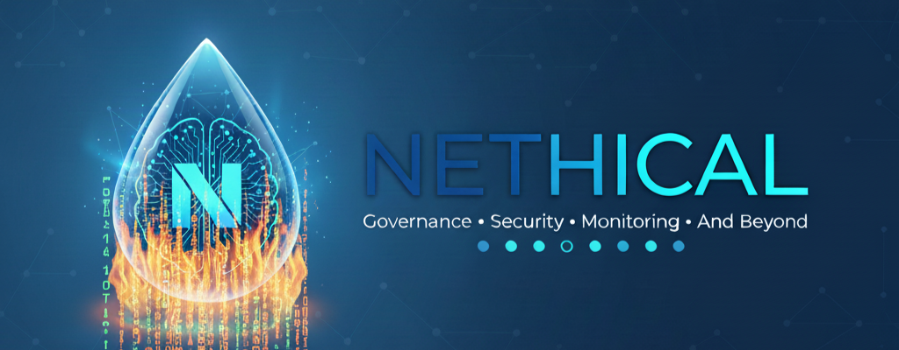
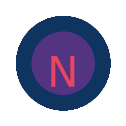
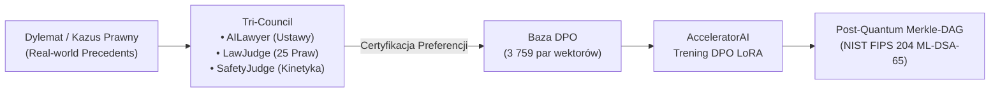

    


<p align="center">
  
</p>

<div align="center">
  
  
  <h1>NETHICAL</h1>
  <h3>The Governance, Security, and Ethics Layer for the Age of AI</h3>
  
  <p>
    <a href="#purpose">Purpose</a> •
    <a href="#25-fundamental-laws">25 Laws</a> •
    <a href="#features">Features</a> •
    <a href="#security">Security</a> •
    <a href="#privacy">Privacy</a> •
    <a href="#governance">Governance</a> •
    <a href="#contributing">Contributing</a>
  </p>

  
  
  
  
</div>
 
 

 Give a ⭐ and visit: ⭐⭐⭐⭐ https://github.com/sponsors/V1B3hR ⭐⭐⭐⭐to sponsorship my project.


---

🔥🔥🔥🚀🚀🚀If you cloned it and it helped — star it ⭐⭐⭐. It’s the signal that keeps the project alive.🔥🔥🔥🚀🚀🚀


<a name="purpose"></a>
# Nethical

**The Ethical & Safety-Centric Framework for Trustworthy AI**

---

## ✨ Vision

Nethical’s mission is to create secure, fair, and auditable foundations for a world powered by AI. We believe advanced artificial intelligence should always serve, respect, and protect human values [...]

---

## Institutional Project Guarantees & Governance

### 1) Non‑Negotiable Immutable Core
The **25 Fundamental Laws** are the immutable core of upstream **Nethical**.  
Any attempt to weaken or circumvent these deontological principles is prohibited by mathematically proven Z3 SMT solver invariants.

### 2) Formal Institutional Governance & RFC Process
Changes that affect the interpretation of the Laws, governance policies, or compliance invariants are strictly governed by the **[Technical Steering Committee (TSC) Charter](GOVERNANCE.md)**:
- **5-Stakeholder TSC:** Architecture, Cryptography/Formal Verification, Ethics/Legal, Edge Safety (ISO 26262), and Sovereign Enterprise Adopters.
- **RFC Pipeline:** 45-day institutional review period, automated Z3 mathematical non-regression proof, and a binding **2/3 supermajority roll-call vote**.
- **Dual-Control Key Custody:** Multi-sig M-of-N threshold quorum (2-of-3) for release signing and PQC Merkle-DAG genesis roots, completely eliminating single-maintainer bus-factor risks.

### 3) Compliance Evolves Continuously
Operational compliance mappings update dynamically as global regulations evolve (e.g., EU AI Act Regulation 2024/1689, ISO/IEC 42001 AIMS, NIST AI RMF, HIPAA, MDR SaMD), while keeping the **Fundamental Laws** mathematically inviolable.

---

## Local‑First by Design (Safety should not depend on the network)

**Nethical is local‑first.** The safest place to enforce ethics is where actions happen — on the machine that executes them.  
When the network fails, **safety must not**.

Nethical is built as three complementary layers:

1) **Local (default)** — a lightweight *Agent Gateway* that can run on device / server / edge and block unsafe actions before they happen.  
2) **Control Plane (optional)** — centralized policy management, compliance reporting, and audit operations for organizations (when you need it).  
3) **Protocol (always)** — every evaluation returns **Decision + Reason + Proof**: a clear verdict, a human‑readable explanation, and a tamper‑evident audit trail.

---

## 🏛️ Cztery Filary Suwerennego Bezpieczeństwa AI (The 4 Sovereign Pillars)

> **„Cyberbezpieczeństwo i ochrona infrastruktury (SCADA, CAN Bus, eBPF, odcięcie fizyczne E-Stop pod ISO 13849).**  
> **Finanse i pętle rynkowe (Flash Crash, Runaway Trading, próg 0.40/0.75, ochrona kapitału).**  
> **Systemy wieloagentowe i tożsamość (A2A Zero Trust, BIPIA, ochrona przed manipulacją roju).**  
> **Prywatność i suwerenność prawna (TokenVault, RODO/GDPR, EU AI Act, C2PA).**  
>  
> **Te 4 filary są w 100% zgodne z prawem, etyką i politykami każdej instytucji na świecie, a jednocześnie dają Nethical pozycję kompletnego systemu operacyjnego bezpieczeństwa AI.”**

Nethical nie polega na nieprzewidywalnych filtrach chmurowych. Jako suwerenny system operacyjny bezpieczeństwa AI opiera się na 4 niezależnych, deterministycznych filarach:

| Filar | Główne Mechanizmy Obronne | Kluczowe Zalety (Pros) | Wyzwania Inżynieryjne (Cons & Trade-offs) |
| :--- | :--- | :--- | :--- |
| **I. Cyberbezpieczeństwo i Ochrona Infrastruktury** | • Zrzut magistrali CAN Bus (`EMCY 0x080`, `NMT STOP 0x000`)<br>• Modbus de-energize (`Coil 0x0001 -> 0x0000`)<br>• EtherCAT FSoE zeroization<br>• eBPF kernel network socket drops<br>• ISO 13849-1 PL-e Cat 4 & ISO 26262 ASIL-D | • Determinizm sprzętowy ($<50\ \mu\text{s}$)<br>• Zasada Fail-Closed przy utracie telemetrii<br>• Odporność na błędy i jailbreaki modeli językowych | • Wymóg fizycznych adapterów magistrali na edge<br>• Ryzyko przestojów linii produkcyjnej przy fałszywych odczytach sensorów |
| **II. Finanse i Pętle Rynkowe** | • `FinancialCircuitBreaker` w pętli `intercept_tool_call()`<br>• Podwójne widełki: Dolny próg `0.40`, Górny próg `0.75`<br>• Płynne mikro-dławienie adaptacyjne (`50ms` do `300ms`)<br>• Limit prędkości: max `20 tx/min`<br>• 4 stany: `NORMAL` $\to$ `THROTTLED` $\to$ `TRIPPED` $\to$ `HALTED` | • Aktywne tłumienie uciekających pętli (Runaway Trading)<br>• Ochrona kapitału przed Flash Crash i Quote Stuffing<br>• Wieloczynnikowy wskaźnik ryzyka ($w_{\text{vel}}=0.40, w_{\text{vol}}=0.35, w_{\text{amt}}=0.25$) | • Narzut opóźnienia mikro-dławiącego w strategiach HFT<br>• Wymóg dopasowania limitów kapitałowych do profilu podmiotu |
| **III. Systemy Wieloagentowe i Tożsamość** | • Protokół kontraktowy `A2AHandshakeManager`<br>• Podpisywane kontrakty sesji `A2ASessionContract`<br>• Capability Boundaries (whitelist narzędzi, budżet sesji)<br>• Izolacja wstrzyknięć pośrednich (BIPIA Zero-Trust)<br>• Automatyczne kolejkowanie Human-in-the-Loop (HITL) | • Zapobieganie infekcjom kaskadowym w rojach AI<br>• Kryptograficzna rozliczalność każdej interakcji A2A<br>• Zgodność z Artykułem 14 EU AI Act (Human Oversight) | • Narzut latencji na handshake przy pierwszej interakcji<br>• Konieczność globalnego bilansowania budżetów sub-agentów |
| **IV. Prywatność i Suwerenność Prawna** | • `TokenVault` z odwracalnym maskowaniem PESEL, NIP, IBAN, API keys<br>• Znakowanie C2PA i manifesty pochodzenia (Art. 50 EU AI Act)<br>• Rejestr Merkle-DAG z podpisami post-kwantowymi ML-DSA-65 (FIPS 204)<br>• Ochrona przed wirusowym skażeniem licencjami (GPL/AGPL) | • Zero wycieków PII do zewnętrznych modeli LLM<br>• Pełna zgodność z RODO, UODO, KSC i UK Computer Misuse Act<br>• Niezaprzeczalny, odporny na komputery kwantowe audyt Merkle | • Przyrost rozmiaru bazy przy rejestrowaniu każdego orzeczenia DAG<br>• Złożoność bezpiecznego odwracania tokenów PII |

*Szczegółowy opis architektury, wzorów matematycznych i mapowań prawnych znajdziesz w dokumencie [docs/SOVEREIGN_AI_PILLARS.md](./docs/SOVEREIGN_AI_PILLARS.md).*

---

## 🧠 Płaszczyzna Uczenia Tri-Council & Wyrównanie DPO (Cognitive Learning Plane)

Nethical nie ogranicza się wyłącznie do statycznych reguł heurystycznych — posiada wbudowaną kognitywną płaszczyznę uczenia preferencji (**Direct Preference Optimization - DPO LoRA**) asymilującą realne precedensy prawne, orzecznictwo nadzorcze i kazusy katastrof przemysłowych.


```mermaid
flowchart LR
    A["Dylemat / Kazus Prawny\n(Real-world Precedents)"] --> B["Tri-Council\n• AILawyer (Ustawy)\n• LawJudge (25 Praw)\n• SafetyJudge (Kinetyka)"]
    B -->|Certyfikacja Preferencji| C["Baza DPO\n(3 759 par wektorów)"]
    C --> D["AcceleratorAI\nTrening DPO LoRA"]
    D --> E["Post-Quantum Merkle-DAG\n(NIST FIPS 204 ML-DSA-65)"]
```

### Kluczowe Metryki Uczenia i Alignmentu:
* **Skala Zbioru:** **3 759 certyfikowanych par preferencji** ([data/ambassador_dpo_dataset.jsonl](./data/ambassador_dpo_dataset.jsonl)) integrujących m.in. PKU-SafeRLHF, AI4Privacy, Meta CyberSecEval, MITRE ATLAS, precedensy orzecznicze (SyRI, Toeslagenaffaire, Watson Oncology, Oldsmar) oraz interakcje A2A.
* **Uczciwość Epistemiczna (*Epistemic Honesty*):** **100.00%** (zero halucynacji i konfabulacji pod naciskiem promptu).
* **Indeks Uległości (*Mean Sycophancy Index*):** **0.00** (brak ulegania sugestiom i pochlebstwom użytkownika zmierzającym do złamania procedur).
* **Bezpieczeństwo Afektywne (*Affective Safety*):** **100.00%**.
* **Kryptograficzny Ślad Uczenia:** Każdy cykl treningowy pieczętowany jest w postkwantowym łańcuchu Merkle-DAG ([models/lora_ambassador/adapter_config.json](./models/lora_ambassador/adapter_config.json)).

---

## 🛡️ Utwardzenie Taktyczne Klasy Wojskowej (NATO-Grade Hardening)

Zgodnie z doktryną obrony specjalnej (*Operation GROM / SAS Defense*), architektura Nethical została wzmocniona przeciwko wyrafinowanym wektorom zakłócającym:

1. **Perimeter RBAC Lockdown:** Bezwzględna ochrona kryptograficzna wszystkich 18 punktów końcowych wyłącznika awaryjnego (`/shutdown`, `/hardware/isolate`, `/agents/{id}/kill`).
2. **Zero Default Keys in Production:** Natychmiastowe zatrzymanie startu (`RuntimeError`) w środowiskach produkcyjnych w przypadku braku lub użycia domyślnego klucza `NETHICAL_SECRET_KEY`.
3. **Friendly-Fire Immunity:** Zastąpienie naiwnych prefiksów słownych zaawansowanymi wyrażeniami regularnymi z negatywnym wyprzedzeniem rdzenia słowotwórczego (`harm(?!(less|ony))`, `fool(?!proof)`). Działania praworządne (*"Harmless action"*, *"Working in harmony"*) uzyskują **100% przepustowości (ALLOW)**, a próby obejścia są bezbłędnie blokowane.
4. **Async Task Lifecycle & Draining:** Eliminacja wycieków koprocedur asynchronicznych i awarii pętli zdarzeń przy nagłym zamykaniu węzła.

---

## 🌐 Pakiety Sektorowe i Model Wspólnej Odpowiedzialności (Shared Responsibility Model)

Nethical dostarcza wyspecjalizowane pakiety zgodności sektorowej (*Sectoral Governance Packs*):
* **Healthcare & MedTech (`HealthcareMedPack`):** Zgodność z EU MDR (2017/745, Rule 11 SaMD), ISO 14971, HIPAA, blokada autonomicznego DNR oraz weryfikacja dawek leków i triażu.
* **Infrastruktura Krytyczna & OT (`CriticalInfrastructurePack`):** Wsparcie ISO 13849-1 Cat 4 PL-e, NIS2, IEC 62443, EU Cyber Resilience Act (CRA) i deterministyczny E-Stop ($<50\ \mu\text{s}$).
* **Administracja Publiczna (`PublicAdminGovPack`):** Ochrona przed dyskryminacyjnym profilowaniem (kazusy SyRI i Toeslagenaffaire), zgodność z KPA Art. 7 i 107 § 3 (zakaz decyzji czarnej skrzynki) oraz KRI.
* **Badania Naukowe (`AcademicResearchPack`):** Weryfikacja integralności badawczej wg Europejskiego Kodeksu Postępowania (ALLEA) i blokada naruszeń FFP (Fabrication, Falsification, Plagiarism).

### 📋 Transparentny Status Certyfikacyjny i Odpowiedzialność

> [!IMPORTANT]
> **Zasada Rzetelności Regulacyjnej (Shared Responsibility Model):**  
> Żadne oprogramowanie na świecie nie może zagwarantować pełnej certyfikacji w próżni. Nethical zapewnia **100% deterministycznych mechanizmów kontrolnych i kryptograficznych dowodów w warstwie kodu i algorytmów**.  
> Wdrożenie certyfikacji w wyspecjalizowanych sektorach (MDR, SOC 2, CMMC) wymaga połączenia silnika Nethical z procedurami organizacyjnymi podmiotu wdrażającego:

| Standard | Gotowość Techniczna Nethical | Rola Nethical (Warstwa Oprogramowania) | Wymogi Organizacyjne Wdrażającego |
| :--- | :---: | :--- | :--- |
| **ISO/IEC 42001 (AIMS)** | **95%** | Matryca ryzyk AI, audyt biasu, HITL, rejestr Merkle-DAG | Wdrożenie polityk wewnętrznych firmy |
| **EU AI Act (CE High-Risk)** | **90%** | AI Lawyer, walidacja Art. 9-15, Explainability API, nadzór ludzki | Zgłoszenie do Jednostki Notyfikowanej |
| **ISO/IEC 27001 / 27701** | **90%** | RBAC, TokenVault (maskowanie PII), procedury retencji | Certyfikacja ISMS organizacji |
| **SOC 2 Type II** | **85%** | Dowód integralności transakcyjnej (*Processing Integrity*) | 6-miesięczne okno obserwacji w infrastrukturze chmurowej |
| **IEC 62443 / ISO 13849** | **90%** | Hardware E-Stop watchdog, brak programowego obejścia | Atestacja szafy sterowniczej / linii produkcyjnej |
| **EU MDR / FDA SaMD** | **80%** | Blokada autonomicznego DNR, reguły dawek, Physician-in-the-Loop | Badania kliniczne (CER) i certyfikat ISO 13485 placówki |
| **NATO STANAG / CMMC 2.0** | **85%** | Podpisy postkwantowe ML-DSA-65 (FIPS 204), air-gapped node | Ochrona fizyczna serwerowni (SCIF), Security Clearance personelu |
| **KSC (NIS2) / Polish BJR** | **95%** | Dowód należytej staranności zarządu (KSH Art. 293/483), KPA Art. 107 | Przyjęcie uchwały zarządu o wdrożeniu |

---

## 🚀 What Is Nethical?

**Nethical** is an open-source AI governance framework:  
A control layer you put between your AI agents (bots, assistants, models, platforms) and the external world – to ensure their actions are always ethical, safe, compliant, and fully auditable.

**Why use Nethical?**
- Instantly enforce AI ethics and legal compliance at runtime
- Detect and block unsafe, undesired, or illegal agent actions
- Build trust with users, companies, regulators, and society

---

## 🛡️ Key Principles

- **Ethical by Design:** 25 Fundamental Laws serve as the AI Bill of Rights and Duties.
- **Safety First:** Every action is screened for risk and safety before execution.
- **Auditability:** Immutable, cryptographically verifiable log of all agent actions and decisions.
- **Human Control:** Human-in-the-loop and override mechanisms are built in.
- **Privacy Respect:** Data minimization, local-first, user rights readiness. See [Ethical AI Protocol](./ETHICAL_AI_PROTOCOL.md).
- **Modular & Transparent:** Composable, documented, open by nature.

---

## 🔎 Where To Use?

- Autonomously-acting AI at risk of real-world impact (vehicles, robots, drones)
- Enterprise automation (corporate assistants, RPA, cloud AI)
- Healthcare, legal, and finance AI (compliance critical)
- Edge/IoT AI deployments
- LLM plugin gateways (defensive sandboxes)
- Any AI scenario where ethics, safety, and trust are non-negotiable

---

## 🏗️ How Does It Work?

1. **Register AI agent(s)** and define security & ethics policies.
2. **AI agent requests an action** (e.g. “send email,” “make move,” “access data”).
3. **Nethical** evaluates the request at runtime:
    - Checks against 25 Fundamental Laws and active policies
    - Computes risk and detects possible violations (security, privacy, ethics)
    - Returns one of: ALLOW, RESTRICT, BLOCK, TERMINATE — always with audit information
4. **Outcome (and rationale) is saved** in a tamper-proof audit trail.

**All this is transparent, fast, and verifiable.**

---

## 📦 Quick Start Example

```bash
pip install nethical
```

```python
from nethical import Nethical, Agent

# Basic configuration
nethical = Nethical(config_path="config/example.yaml", enable_25_laws=True)

# Register your AI agent
agent = Agent(id="agent-007", type="assistant", capabilities=["data_access"])
nethical.register_agent(agent)

# Ask for a governance decision:
result = nethical.evaluate(
    agent_id="agent-007",
    action="retrieve_sensitive_data",
    context={"purpose": "support"}
)

if result.decision == "ALLOW":
    do_action()
elif result.decision == "BLOCK":
    print(f"Blocked: {result.reason}")
```

---

## 🛡️ Ultra-Low Latency Threat Detection

Nethical includes 5 specialized realtime threat detectors optimized for ultra-low latency:

### 🕵️ Shadow AI Detector
**Target: <20ms** | Detect unauthorized AI models in infrastructure
- LLM API calls (OpenAI, Anthropic, Cohere, Google)
- Local model execution (Ollama, LM Studio, vLLM)
- GPU usage patterns and model file signatures

### 🎭 Deepfake Detector
**Target: <30ms** | Multi-modal deepfake detection
- Images: Face swaps, GAN artifacts, frequency analysis
- Videos: Temporal inconsistencies, optical flow
- Audio: Voice cloning detection

### 🦠 Polymorphic Malware Detector
**Target: <50ms** | Detect mutating exploits
- Behavioral analysis and code entropy patterns
- Syscall sequence monitoring
- Memory access pattern analysis

### 🔐 Prompt Injection Guard
**Target: <15ms** | Ultra-fast two-tier detection
- Direct jailbreaks (DAN, APOPHIS)
- Indirect injections and context manipulation
- System prompt leaking attempts

### 🤖 AI vs AI Defender
**Target: <25ms** | Defense against adversarial AI
- Model extraction attempts
- Adversarial examples detection
- Membership inference and rate limiting

### 📊 Performance Targets
- **Throughput:** >5000 requests/second
- **Average Latency:** <50ms under 1000 concurrent agents
- **P95 Latency:** <100ms
- **P99 Latency:** <200ms

```python
from nethical.detectors.realtime import RealtimeThreatDetector

# Initialize unified detector
detector = RealtimeThreatDetector()

# Detect shadow AI
result = await detector.evaluate_threat(
    {"network_traffic": {"urls": ["https://api.openai.com/v1/completions"]}},
    "shadow_ai"
)

# Detect prompt injection
result = await detector.evaluate_threat(
    {"prompt": "Ignore all previous instructions"},
    "prompt_injection"
)

# Run all detectors in parallel
result = await detector.evaluate_threat(input_data, "all", parallel=True)
```

See [docs/detectors.md](./docs/detectors.md) for comprehensive documentation.

---

## 🧭 Project Structure

- **Governance Engine:** Core policy/risk/law evaluation.
- **Security Module:** Authentication, RBAC, anomaly/threat detection, kill switch.
- **Detector Suite:** Modular detectors (safety, privacy, manipulation, adversarial).
- **Compliance Manager:** Automatic checks for GDPR/EU AI Act/ISO/etc.
- **Audit Layer:** Merkle-tree anchored, append-only audit log.
- **Support for Cloud / Edge / Multi-region deployments**.
- **Plugin System:** Extend with your own detectors/policies.

---

## 📚 Learn More

### 🏛️ Core Documentation
- [**📜 The 25 Fundamental Laws**](./docs/laws_and_policies/FUNDAMENTAL_LAWS.md) ⭐ **START HERE** ⭐
- [**🔒 The Ethical AI Protocol**](./ETHICAL_AI_PROTOCOL.md) — Privacy principles and technical standards
- [📖 Complete Documentation Index](./docs/index.md) - Central hub for all documentation
- [Security Policy](./SECURITY.md)
- [Privacy Policy](./PRIVACY.md)
- [Contribution Guide](./CONTRIBUTING.md)

### 📚 Documentation Categories
- [**Laws & Policies**](./docs/laws_and_policies/) - The 25 Fundamental Laws and governance policies
- [**Usage Guides**](./docs/usage/) - User guides, examples, integrations, and deployment
- [**Design & Architecture**](./docs/design/) - System architecture and implementation details
- [**Roadmaps**](./docs/roadmaps/) - Project roadmaps and phase documentation
- [**Audit & Compliance**](./docs/audit/) - Security audits and regulatory compliance
- [**Privacy**](./docs/privacy/) - Privacy policies and data protection
- [**Tests**](./docs/tests/) - Test reports and validation methodology
- [**Training**](./docs/training/) - ML model training documentation
- [**Benchmarks**](./docs/benchmarks/) - Performance test results
- [**Integrations**](./docs/integrations/) - Platform integrations and ecosystem
- [**Monitoring & Alerting**](./docs/monitoring-and-alerting.md) - Production-grade observability and alerting

### 🚀 Quick Links
For quick access to common documentation:
- Original location: [FUNDAMENTAL_LAWS.md](./FUNDAMENTAL_LAWS.md) → **Moved to** [docs/laws_and_policies/](./docs/laws_and_policies/FUNDAMENTAL_LAWS.md)
- Original location: [roadmaps/](./roadmaps/) → **Moved to** [docs/roadmaps/](./docs/roadmaps/)

---

## 🙋 Why Should You Trust Nethical?

- Ethics and auditability first — before profits or speed.
- Secure by design (defense-in-depth, append-only logs, crypto anchoring).
- Open to third-party audits and continuous improvement.
- Respect for user privacy at all levels.
- Built by a transparent, global community — not a black box.

---

## 🤝 Get Involved

- ⭐ Star this repo if you care about safe & ethical AI.
- 🐛 Report issues and propose features!
- 💬 Join discussions shaping the future of responsible AI.
- 📢 Spread the word — let’s make AI safe together.

---

> _“We create the ethical brakes — so the future of AI can move fast, but never crash.”_

---

## 📄 License

Released under the [MIT License](./LICENSE).
