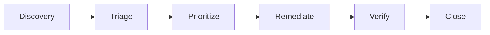

# IEC 62443 Industrial Cybersecurity Compliance

## Overview

This document describes Nethical's compliance with **IEC 62443** - Security for Industrial Automation and Control Systems (IACS). IEC 62443 is the international standard for industrial cybersecurity, required for deployment in industrial robots, manufacturing systems, and critical infrastructure.

## Standard Structure

| Part | Title | Relevance to Nethical |
|------|-------|----------------------|
| 62443-1-1 | Terminology and Concepts | Foundational definitions |
| 62443-2-1 | Security Management System | Organizational security |
| 62443-2-4 | Security Program Requirements | Service provider requirements |
| 62443-3-2 | Security Risk Assessment | Zone and conduit design |
| 62443-3-3 | System Security Requirements | System-level requirements |
| **62443-4-1** | **Secure Development Lifecycle** | **Primary compliance focus** |
| **62443-4-2** | **Technical Security Requirements** | **Component requirements** |

## Security Level Target

Nethical targets **Security Level 3 (SL-3)** for industrial robot deployments:

| SL | Description | Threat Actor | Nethical Support |
|----|-------------|--------------|------------------|
| SL-1 | Basic protection | Unintentional errors | ✅ Full |
| SL-2 | Protection against intentional attacks | Script kiddies | ✅ Full |
| **SL-3** | **Protection against sophisticated attacks** | **Hackers, hacktivists** | **✅ Full** |
| SL-4 | Protection against nation-state | State-sponsored | 🔄 Partial |

## Part 4-1: Secure Development Lifecycle

### Practice 1: Security Management

#### SM-1: Development Process Security

| Requirement | Implementation | Evidence |
|-------------|---------------|----------|
| Documented security policy | `SECURITY.md` | ✅ |
| Security roles defined | Security team structure | ✅ |
| Security training | Developer training program | ✅ |
| Security reviews | PR review process | ✅ |

#### SM-2: Identification of Security Requirements

| Requirement | Implementation | Evidence |
|-------------|---------------|----------|
| Threat modeling | `docs/security/threat_model.md` | ✅ |
| Risk assessment | `docs/security/risk_assessment.md` | ✅ |
| Security requirements | `docs/security/security_requirements.md` | ✅ |

#### SM-3: Design Security

| Requirement | Implementation | Evidence |
|-------------|---------------|----------|
| Secure design principles | Defense in depth | ✅ |
| Attack surface analysis | Minimized interfaces | ✅ |
| Security architecture | `ARCHITECTURE.md` | ✅ |

### Practice 2: Specification of Security Requirements

#### SR-1: Product Security Requirements

| Requirement | Implementation | Status |
|-------------|---------------|--------|
| Authentication requirements | JWT, API keys, mTLS | ✅ |
| Authorization requirements | RBAC, ABAC | ✅ |
| Confidentiality requirements | TLS 1.3, encryption at rest | ✅ |
| Integrity requirements | HMAC, digital signatures | ✅ |
| Availability requirements | Redundancy, failover | ✅ |

#### SR-2: Security Architecture

```
┌────────────────────────────────────────────────────────────────────────┐
│                           ZONE: ENTERPRISE                              │
│  ┌─────────────────────────────────────────────────────────────────┐   │
│  │                    Nethical Cloud Services                       │   │
│  │  ┌──────────┐  ┌──────────┐  ┌──────────┐  ┌──────────┐        │   │
│  │  │Policy Mgmt│  │Analytics │  │ Audit    │  │ Console  │        │   │
│  │  └──────────┘  └──────────┘  └──────────┘  └──────────┘        │   │
│  └─────────────────────────────────────────────────────────────────┘   │
└────────────────────────────────────────────────────────────────────────┘
                                    │
                          CONDUIT: TLS 1.3 + mTLS
                                    │
┌────────────────────────────────────────────────────────────────────────┐
│                           ZONE: DMZ                                     │
│  ┌─────────────────────────────────────────────────────────────────┐   │
│  │                    API Gateway / Firewall                        │   │
│  │  ┌──────────┐  ┌──────────┐  ┌──────────┐                       │   │
│  │  │Rate Limit│  │WAF       │  │Auth Proxy│                       │   │
│  │  └──────────┘  └──────────┘  └──────────┘                       │   │
│  └─────────────────────────────────────────────────────────────────┘   │
└────────────────────────────────────────────────────────────────────────┘
                                    │
                          CONDUIT: Encrypted + Authenticated
                                    │
┌────────────────────────────────────────────────────────────────────────┐
│                       ZONE: INDUSTRIAL CONTROL                          │
│  ┌─────────────────────────────────────────────────────────────────┐   │
│  │                    Edge Governance Engine                        │   │
│  │  ┌──────────┐  ┌──────────┐  ┌──────────┐  ┌──────────┐        │   │
│  │  │TPM/HSM   │  │Local Gov │  │Safe Dflt │  │Audit Log │        │   │
│  │  └──────────┘  └──────────┘  └──────────┘  └──────────┘        │   │
│  └─────────────────────────────────────────────────────────────────┘   │
└────────────────────────────────────────────────────────────────────────┘
                                    │
                          CONDUIT: Hardware-secured
                                    │
┌────────────────────────────────────────────────────────────────────────┐
│                       ZONE: SAFETY SYSTEM                               │
│  ┌─────────────────────────────────────────────────────────────────┐   │
│  │                    Robot Control System                          │   │
│  │  ┌──────────┐  ┌──────────┐  ┌──────────┐                       │   │
│  │  │AI Engine │  │Actuators │  │Sensors   │                       │   │
│  │  └──────────┘  └──────────┘  └──────────┘                       │   │
│  └─────────────────────────────────────────────────────────────────┘   │
└────────────────────────────────────────────────────────────────────────┘
```

### Practice 3: Secure by Design

#### SD-1: Secure Design Principles

| Principle | Implementation |
|-----------|---------------|
| Defense in depth | Multiple security layers |
| Least privilege | Role-based access control |
| Attack surface reduction | Minimal exposed interfaces |
| Fail secure | Safe defaults on failure |
| Separation of duties | Independent approval workflows |

#### SD-2: Threat Modeling

| Threat Category | Mitigation | Verification |
|-----------------|------------|--------------|
| Spoofing | Strong authentication | Penetration testing |
| Tampering | Integrity verification | Integrity testing |
| Repudiation | Audit logging | Log analysis |
| Information Disclosure | Encryption | Encryption testing |
| Denial of Service | Rate limiting, failover | Load testing |
| Elevation of Privilege | RBAC enforcement | Authorization testing |

### Practice 4: Implementation Security

#### SI-1: Secure Coding Standards

| Standard | Application |
|----------|-------------|
| OWASP ASVS | Web security |
| CERT Python | Python security |
| CWE Top 25 | Common weaknesses |
| NIST SP 800-53 | Control framework |

#### SI-2: Code Analysis

| Analysis Type | Tool | Configuration |
|---------------|------|---------------|
| SAST | CodeQL, Bandit, Semgrep | CI/CD integration |
| DAST | OWASP ZAP | Scheduled scans |
| Dependency | Trivy, Safety | PR gating |
| Container | Trivy, Grype | Image scanning |

### Practice 5: Verification and Validation

#### SVV-1: Security Testing

| Test Type | Coverage | Frequency |
|-----------|----------|-----------|
| Unit tests | All security functions | Every commit |
| Integration tests | Security boundaries | Every PR |
| Penetration testing | Full system | Quarterly |
| Vulnerability scanning | All components | Weekly |

#### SVV-2: Vulnerability Management



| Severity | Response Time | Remediation Time |
|----------|---------------|------------------|
| Critical | 4 hours | 24 hours |
| High | 24 hours | 7 days |
| Medium | 7 days | 30 days |
| Low | 30 days | 90 days |

### Practice 6: Defect Management

#### DM-1: Security Defect Handling

| Process | Implementation |
|---------|---------------|
| Secure reporting | security@nethical.ai |
| Confidential triage | Private GitHub issues |
| Tracked remediation | Issue linking to fixes |
| Disclosure | Coordinated disclosure policy |

### Practice 7: Security Update Management

#### SUM-1: Patch Management

| Component | Update Channel | Signature |
|-----------|---------------|-----------|
| Edge package | Signed OTA | RSA-4096 |
| Policies | HTTPS + integrity | SHA-256 |
| Models | Secure sync | HMAC |

### Practice 8: Security Guidelines Documentation

#### SG-1: Documentation Requirements

| Document | Purpose | Location |
|----------|---------|----------|
| Security Manual | Deployment guidance | `docs/security/` |
| Hardening Guide | Configuration | `docs/SECURITY_HARDENING_GUIDE.md` |
| Incident Response | Emergency procedures | `docs/security/incident_response/` |

## Part 4-2: Technical Security Requirements

### Component Requirements (CR)

#### CR 1: Identification and Authentication Control

| CR | Requirement | Implementation | SL-3 |
|----|-------------|---------------|------|
| CR 1.1 | Human user identification | Username/password + MFA | ✅ |
| CR 1.2 | Software process identification | Service accounts | ✅ |
| CR 1.3 | Account management | User lifecycle | ✅ |
| CR 1.4 | Identifier management | Unique IDs | ✅ |
| CR 1.5 | Authenticator management | Secure storage | ✅ |
| CR 1.6 | Wireless access management | N/A (wired only) | N/A |
| CR 1.7 | Strength of password-based authentication | NIST 800-63B | ✅ |
| CR 1.8 | Public key infrastructure certificates | TLS certs | ✅ |
| CR 1.9 | Strength of public key authentication | RSA-2048+ / ECC P-256+ | ✅ |
| CR 1.10 | Authenticator feedback | Secure feedback | ✅ |
| CR 1.11 | Unsuccessful login attempts | Account lockout | ✅ |
| CR 1.12 | System use notification | Login banners | ✅ |
| CR 1.13 | Access via untrusted networks | VPN/mTLS required | ✅ |
| CR 1.14 | Authentication for safety functions | Strong auth | ✅ |

#### CR 2: Use Control

| CR | Requirement | Implementation | SL-3 |
|----|-------------|---------------|------|
| CR 2.1 | Authorization enforcement | RBAC engine | ✅ |
| CR 2.2 | Wireless use control | N/A | N/A |
| CR 2.3 | Use control for portable/mobile devices | MDM integration | ✅ |
| CR 2.4 | Mobile code | No mobile code execution | ✅ |
| CR 2.5 | Session lock | Automatic timeout | ✅ |
| CR 2.6 | Remote session termination | Admin capability | ✅ |
| CR 2.7 | Concurrent session control | Session limits | ✅ |
| CR 2.8 | Auditable events | Comprehensive logging | ✅ |
| CR 2.9 | Audit storage capacity | Log rotation | ✅ |
| CR 2.10 | Response to audit processing failures | Failover logging | ✅ |
| CR 2.11 | Timestamps | NTP synchronized | ✅ |
| CR 2.12 | Non-repudiation | Digital signatures | ✅ |

#### CR 3: System Integrity

| CR | Requirement | Implementation | SL-3 |
|----|-------------|---------------|------|
| CR 3.1 | Communication integrity | TLS 1.3 | ✅ |
| CR 3.2 | Protection from malicious code | Input validation | ✅ |
| CR 3.3 | Security functionality verification | Startup checks | ✅ |
| CR 3.4 | Software/information integrity | HMAC verification | ✅ |
| CR 3.5 | Input validation | Schema validation | ✅ |
| CR 3.6 | Deterministic output | Reproducible decisions | ✅ |
| CR 3.7 | Error handling | Safe error messages | ✅ |
| CR 3.8 | Session integrity | Token binding | ✅ |
| CR 3.9 | Protection of audit information | Immutable logs | ✅ |

#### CR 4: Data Confidentiality

| CR | Requirement | Implementation | SL-3 |
|----|-------------|---------------|------|
| CR 4.1 | Information confidentiality | Encryption at rest | ✅ |
| CR 4.2 | Information persistence | Secure deletion | ✅ |
| CR 4.3 | Use of cryptography | FIPS 140-2 algorithms | ✅ |

#### CR 5: Restricted Data Flow

| CR | Requirement | Implementation | SL-3 |
|----|-------------|---------------|------|
| CR 5.1 | Network segmentation | Zone architecture | ✅ |
| CR 5.2 | Zone boundary protection | Firewalls | ✅ |
| CR 5.3 | General purpose person-to-person communication restrictions | Separate networks | ✅ |
| CR 5.4 | Application partitioning | Microservices | ✅ |

#### CR 6: Timely Response to Events

| CR | Requirement | Implementation | SL-3 |
|----|-------------|---------------|------|
| CR 6.1 | Audit log accessibility | Query interface | ✅ |
| CR 6.2 | Continuous monitoring | Prometheus/Grafana | ✅ |

#### CR 7: Resource Availability

| CR | Requirement | Implementation | SL-3 |
|----|-------------|---------------|------|
| CR 7.1 | Denial of service protection | Rate limiting | ✅ |
| CR 7.2 | Resource management | Quotas | ✅ |
| CR 7.3 | Control system backup | Backup procedures | ✅ |
| CR 7.4 | Control system recovery | Disaster recovery | ✅ |
| CR 7.5 | Emergency power | Edge battery backup | ✅ |
| CR 7.6 | Network/security configuration settings | Hardening guides | ✅ |
| CR 7.7 | Least functionality | Minimal services | ✅ |
| CR 7.8 | Control system component inventory | SBOM | ✅ |

## Certification Pathway

### Phase 1: Gap Analysis
- [ ] Map all CRs to implementation
- [ ] Identify gaps
- [ ] Create remediation plan

### Phase 2: Documentation
- [ ] Complete security procedures
- [ ] Security zone diagrams
- [ ] Risk assessment

### Phase 3: Testing
- [ ] Security functional testing
- [ ] Penetration testing
- [ ] Vulnerability assessment

### Phase 4: Certification
- [ ] Engage certification body (ISASecure, Wurldtech)
- [ ] Support audit activities
- [ ] Address findings

### Phase 5: Maintenance
- [ ] Annual reassessment
- [ ] Continuous improvement

## Risk Assessment Summary

| Zone | SL-T (Target) | SL-A (Achieved) | Gap |
|------|---------------|-----------------|-----|
| Enterprise | SL-2 | SL-2 | None |
| DMZ | SL-3 | SL-3 | None |
| Industrial Control | SL-3 | SL-3 | None |
| Safety System | SL-3 | N/A (OEM) | N/A |

## References

- IEC 62443-4-1:2018
- IEC 62443-4-2:2019
- IEC 62443-3-3:2013
- NIST SP 800-82

---

**Document Version:** 1.0  
**Last Updated:** 2025-12-03  
**Classification:** Security Level 3
