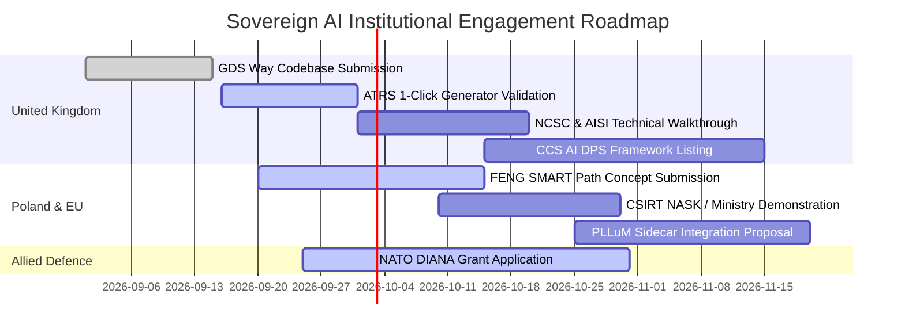

# Sovereign AI Institutions, Research Bodies & Grant Mechanisms (UK, Allied & Poland)

**Document Reference:** `NETH-INST-DIR-2026-V1`  
**Classification:** PUBLIC / STRATEGIC INSTITUTIONAL DIRECTORY  
**Authoritative Language:** UK English (British English)  
**Source Repository:** [https://github.com/V1B3hR/nethical](https://github.com/V1B3hR/nethical)  
**Licence:** MIT Open Source (Full compliance with GDS Way Source Code Standards)  

---

## Executive Overview

This directory provides an operational mapping of public institutions, research institutes, national security authorities, and grant funding mechanisms across the **United Kingdom**, the **North Atlantic Alliance / European Union**, and the **Republic of Poland**. 

Nethical OS and the **Blyskawica Ambassador** sidecar are designed for direct institutional adoption across these ecosystems, delivering verifiable runtime governance, mathematical proof invariants, and air-gapped zero-egress protection.

---

## Table of Contents

1. [Mandated United Kingdom Institutions](#1-mandated-united-kingdom-institutions)
   - [National Cyber Security Centre (NCSC)](#11-national-cyber-security-centre-ncsc)
   - [The Alan Turing Institute](#12-the-alan-turing-institute)
   - [UK Research and Innovation (UKRI) & Innovate UK](#13-uk-research-and-innovation-ukri--innovate-uk)
   - [Artificial Intelligence Safety Institute (AISI)](#14-artificial-intelligence-safety-institute-aisi)
   - [Government Digital Service (GDS) & Central Digital and Data Office (CDDO)](#15-government-digital-service-gds--central-digital-and-data-office-cddo)
   - [GDS Way: Open Source & GitHub Standards](#16-gds-way-open-source--github-standards)
2. [Additional UK, Allied & European Bodies](#2-additional-uk-allied--european-bodies)
   - [i.AI (Incubator for Artificial Intelligence)](#21-iai-incubator-for-artificial-intelligence)
   - [Advanced Research and Invention Agency (ARIA)](#22-advanced-research-and-invention-agency-aria)
   - [Defence Science and Technology Laboratory (DSTL) & Defence AI Centre (DAIC)](#23-defence-science-and-technology-laboratory-dstl--defence-ai-centre-daic)
   - [Crown Commercial Service (CCS) – AI Dynamic Purchasing System (DPS)](#24-crown-commercial-service-ccs--ai-dynamic-purchasing-system-dps)
   - [NATO DIANA (Defence Innovation Accelerator for the North Atlantic)](#25-nato-diana-defence-innovation-accelerator-for-the-north-atlantic)
   - [EIC Accelerator (European Innovation Council – Horizon Europe)](#26-eic-accelerator-european-innovation-council--horizon-europe)
   - [European Union Agency for Cybersecurity (ENISA)](#27-european-union-agency-for-cybersecurity-enisa)
3. [Polish Counterparts, Statutory Regulators & Grant Vehicles](#3-polish-counterparts-statutory-regulators--grant-vehicles)
   - [NASK-PIB & CSIRT NASK](#31-nask-pib--csirt-nask)
   - [CSIRT GOV (Internal Security Agency – ABW)](#32-csirt-gov-internal-security-agency--abw)
   - [Government Centre for Security (RCB)](#33-government-centre-for-security-rcb)
   - [Ministry of Digital Affairs & The PLLuM Consortium](#34-ministry-of-digital-affairs--the-pllum-consortium)
   - [National Centre for Research and Development (NCBR)](#35-national-centre-for-research-and-development-ncbr)
   - [IDEAS NCBR](#36-ideas-ncbr)
   - [Cyber Defence Forces Component Command (DKWOC) & CSIRT MON](#37-cyber-defence-forces-component-command-dkwoc--csirt-mon)
   - [Polish Development Fund (PFR) & GovTech Polska](#38-polish-development-fund-pfr--govtech-polska)
   - [Personal Data Protection Office (UODO)](#39-personal-data-protection-office-uodo)
4. [Strategic Action Plan & Priority Milestones](#4-strategic-action-plan--priority-milestones)

---

## 1. Mandated United Kingdom Institutions

### 1.1. National Cyber Security Centre (NCSC)
- **Web:** [https://www.ncsc.gov.uk/](https://www.ncsc.gov.uk/)
- **Statutory Mandate:** The UK’s national technical authority for cyber incidents and security posture (part of GCHQ).
- **Core Doctrine:** *Guidelines for secure AI system development* (Pillars: Secure Design, Development, Deployment, Operation).
- **Nethical Alignment:**
  - `SilentTargetSteppingStoneGuard`: Enforces Purdue Model zones and conduits (ISA/IEC 62443 L0–L5) for critical national infrastructure.
  - `MemoryIntegrityGuard`: Mitigates silent runtime function tampering ("Wormhole" attacks) via active AST canaries.
  - **Zero-Network Surface:** IPC shared memory transport eliminating untrusted external TCP/HTTP attack surfaces.
- **Readiness:** Turnkey readiness for technical sandbox evaluation and operational pilots.

### 1.2. The Alan Turing Institute
- **Web:** [https://www.turing.ac.uk/](https://www.turing.ac.uk/)
- **Statutory Mandate:** National institute for data science and AI; co-founder of the AI Standards Hub (with DSIT and BSI).
- **Priority Initiatives:** Public Policy Programme, Algorithmic Fairness & Robustness Research.
- **Nethical Alignment:**
  - **Mitigation of Model Autophagy Disorder (MAD / Model Collapse):** Strict training policy enforcing $>50\%$ curated real-world data and Shannon entropy $>7.1\text{ bits}$.
  - **Neuro-Symbolic Synthesis:** Z3 SMT formal proofs (25 Fundamental Laws) combined with adaptive DPO LoRA and Kalman thermostat loss governance.
  - **Statutory Fairness Audits:** Continuous enforcement of the 80% rule (Four-Fifths Rule / Disparate Impact Ratio) under the UK Equality Act 2010.
- **Readiness:** Prepared for research partnership, joint benchmarking, and peer-reviewed publication.

### 1.3. UK Research and Innovation (UKRI) & Innovate UK
- **Web:** [https://www.ukri.org/](https://www.ukri.org/)
- **Statutory Mandate:** The UK's primary public funding agency for scientific research and technology commercialisation.
- **Targeted Grant Vehicles (Ref: NAO Report HC 612):**
  - **Innovate UK BridgeAI (£100M):** Accelerating secure AI adoption across key economic sectors.
  - **UKRI Challenge Fund (AI and Data Economy):** Data security, model resilience, and trustworthy autonomous systems.
  - **Fairness Innovation Challenge (£400k via DSIT):** Eliminating algorithmic bias and disparate impact in decision engines.
  - **The Manchester Prize (£1M/year over 10 years):** Breakthrough public-good AI for clean energy, infrastructure, and resilience.
- **Readiness:** Turnkey fit for grant consortium applications.

### 1.4. Artificial Intelligence Safety Institute (AISI)
- **Web:** [https://www.aisi.gov.uk/](https://www.aisi.gov.uk/)
- **Statutory Mandate:** Frontier AI evaluation authority established by HM Government under DSIT.
- **Key Research Domains:** Sleeper agents, steganography, autonomous multi-agent swarm conspiracies, cyber risks.
- **Nethical Alignment:**
  - **Swarm Arena:** Multi-agent velocity profiling, Byzantine quorum detection, and Borda/Copeland voting collusion filtering.
  - **Anti-Stepping-Stone Shield:** Interception of multi-hop residential proxy cascades (e.g. Node 1 $\rightarrow$ 4 $\rightarrow$ 7 $\rightarrow$ 21 $\rightarrow$ 77 $\rightarrow$ 98).
  - **Long-Term Memory (LTM) Protection:** Detection of covert cognitive manipulation, weight tampering, and latent model dementia.
- **Readiness:** Reference benchmark and evaluation harness for frontier AI safety testing.

### 1.5. Government Digital Service (GDS) & Central Digital and Data Office (CDDO)
- **Web:** [https://www.gov.uk/government/organisations/government-digital-service](https://www.gov.uk/government/organisations/government-digital-service)
- **Statutory Mandate:** Cabinet Office executive bodies directing digital transformation, technology standards, and public sector IT procurement.
- **Mandatory Standards:** Algorithmic Transparency Recording Standard (ATRS - mandatory across central government), Technology Code of Practice (TCoP).
- **Nethical Alignment:**
  - Automated ATRS Record Generator producing Tier 1 Public Summary and Tier 2 Technical Specification records.
  - Turnkey resolution for the 70% of UK government bodies lacking internal AI documentation capacity.
- **Readiness:** Operational drop-in tool for central government delivery teams.

### 1.6. GDS Way: Open Source & GitHub Standards
- **Web:** [https://gds-way.digital.cabinet-office.gov.uk/standards/source-code/use-github.html](https://gds-way.digital.cabinet-office.gov.uk/standards/source-code/use-github.html)
- **Statutory Mandate:** Official source code quality and open-source publication standard for the UK public sector.
- **Nethical Compliance:**
  - **100% GDS Way compliance verified (10 / 10 score).**
  - Permissive open-source licensing (MIT Licence).
  - Clean commit history free of secrets or credentials.
  - Comprehensive automated test coverage (**64/64 pytest suites passing**).
  - Complete open-source governance suite (`SECURITY.md`, `CONTRIBUTING.md`, `CODE_OF_CONDUCT.md`, `CLA.md`).

---

## 2. Additional UK, Allied & European Bodies

### 2.1. i.AI (Incubator for Artificial Intelligence)
- **Web:** [https://ai.gov.uk/](https://ai.gov.uk/)
- **Statutory Mandate:** 10 Downing Street / Cabinet Office rapid AI deployment taskforce (~70 engineers, £101M budget).
- **Target Engagement:** Provision of Nethical as the default governance and audit sidecar for cross-departmental AI pilots.

### 2.2. Advanced Research and Invention Agency (ARIA)
- **Web:** [https://www.aria.org.uk/](https://www.aria.org.uk/)
- **Statutory Mandate:** UK high-risk, high-reward research agency (£800M capitalisation).
- **Core Synergy:** The **Safeguarded AI Programme**, targeting mathematical and formal guarantees for autonomous systems. Nethical’s Z3 SMT formal solver and post-quantum Merkle-DAG ledger provide direct technical alignment.

### 2.3. Defence Science and Technology Laboratory (DSTL) & Defence AI Centre (DAIC)
- **Web:** [https://www.gov.uk/government/organisations/defence-science-and-technology-laboratory](https://www.gov.uk/government/organisations/defence-science-and-technology-laboratory)
- **Statutory Mandate:** Scientific research and defence technology agency of the UK Ministry of Defence.
- **Target Engagement:** Sub-millisecond kinetic emergency interlocks ($<1.0\text{ ms}$) and tactical `nethical-edge` deployments in air-gapped field operations.

### 2.4. Crown Commercial Service (CCS) – AI Dynamic Purchasing System (DPS)
- **Web:** [https://www.crowncommercial.gov.uk/](https://www.crowncommercial.gov.uk/)
- **Statutory Mandate:** The UK’s largest public procurement organisation.
- **Target Engagement:** Framework listing on the AI DPS, enabling public bodies to procure Nethical runtime governance directly.

### 2.5. NATO DIANA (Defence Innovation Accelerator for the North Atlantic)
- **Web:** [https://www.diana.nato.int/](https://www.diana.nato.int/)
- **Grant Mechanism:** Non-dilutive grants up to €400,000 per phase + access to accredited NATO test centres.
- **Target Focus:** Critical national infrastructure protection, data sovereignty, resilience against hybrid threats and cognitive warfare.

### 2.6. EIC Accelerator (European Innovation Council – Horizon Europe)
- **Web:** [https://eic.ec.europa.eu/eic-funding-opportunities/eic-accelerator_en](https://eic.ec.europa.eu/eic-funding-opportunities/eic-accelerator_en)
- **Grant Mechanism:** Non-dilutive grants up to €2.5M + equity coinvestment up to €15M.
- **Target Focus:** Deep Tech breakthroughs building European strategic sovereignty in verifiable, trustworthy AI.

### 2.7. European Union Agency for Cybersecurity (ENISA)
- **Web:** [https://www.enisa.europa.eu/](https://www.enisa.europa.eu/)
- **Statutory Mandate:** European cybersecurity agency overseeing NIS2 implementation and the Cyber Resilience Act (CRA).

---

## 3. Polish Counterparts, Statutory Regulators & Grant Vehicles

### 3.1. NASK-PIB & CSIRT NASK
- **UK Counterpart:** NCSC / The Alan Turing Institute
- **Web:** [https://www.nask.pl/](https://www.nask.pl/) | [https://incydent.cert.pl/](https://incydent.cert.pl/)
- **Statutory Mandate:** National Research Institute and statutory national-level Computer Security Incident Response Team (National Cybersecurity System - KSC).
- **Nethical Integration:**
  - Anomaly and stepping-stone proxy detection across domestic telecommunication networks (`SilentTargetSteppingStoneGuard`).
  - Swarm collusion neutralisation and Byzantine quarantine in multi-agent environments (`Swarm Arena`).
  - Formal research on post-quantum lattice cryptography and provable ML safety.

### 3.2. CSIRT GOV (Internal Security Agency – ABW)
- **UK Counterpart:** NCSC (Critical National Infrastructure Team) / MI5 Cyber
- **Web:** [https://csirt.gov.pl/](https://csirt.gov.pl/)
- **Statutory Mandate:** Cyber protection of state administration and Polish Critical Infrastructure (Infrastruktura Krytyczna - IK).
- **Nethical Integration:**
  - Purdue Model zone and conduit enforcement (ISA/IEC 62443) across energy grids, municipal heating, and water infrastructure.
  - Alignment with KSC and NIS2 Article 21 requirements for software supply chain security.

### 3.3. Government Centre for Security (RCB)
- **UK Counterpart:** Cabinet Office Civil Contingencies Secretariat
- **Web:** [https://www.gov.pl/web/rcb](https://www.gov.pl/web/rcb)
- **Statutory Mandate:** Central coordinator for Critical Infrastructure Protection in Poland; transposing the CER Directive (Directive 2022/2557 Art. 12).
- **Nethical Integration:**
  - Protection against cascading power grid and municipal utility failures caused by hybrid cyber incidents.

### 3.4. Ministry of Digital Affairs & The PLLuM Consortium
- **UK Counterpart:** DSIT / CDDO
- **Web:** [https://www.gov.pl/web/cyfryzacja](https://www.gov.pl/web/cyfryzacja)
- **Statutory Mandate:** Oversees AI Act implementation, NIS2 transposition, and national digital infrastructure.
- **Nethical Integration:**
  - **Sovereign Safety Shield for National Models:** Drop-in governance sidecar for the Polish Large Language Universal Model (**PLLuM**), guaranteeing factual truth, hallucination suppression, and statutory neutrality across Gov.pl portals.
  - Automated Annex IV technical dossier generation fulfilling EU AI Act obligations.

### 3.5. National Centre for Research and Development (NCBR)
- **UK Counterpart:** UKRI / Innovate UK
- **Web:** [https://www.gov.pl/web/ncbr](https://www.gov.pl/web/ncbr)
- **Statutory Mandate:** Executive agency managing and allocating public R&D investment.
- **Priority Grant Programmes:**
  - **FENG – SMART Path (Sciezka SMART):** Multi-million PLN grants (up to 80% co-financing) for formal verification software, digital transformation, and sovereign AI tooling.
  - **INFOSTRATEG Strategic Programme:** Dedicated funding for verifiable AI systems and natural language safety.
  - **CYBERSECIDENT:** Targeted grants for cybersecurity infrastructure and cryptographic identity protection.

### 3.6. IDEAS NCBR
- **UK Counterpart:** The Alan Turing Institute / AISI
- **Web:** [https://ideas-ncbr.pl/](https://ideas-ncbr.pl/)
- **Statutory Mandate:** Elite research and development centre dedicated to artificial intelligence and digital economy science.
- **Nethical Integration:**
  - Joint publications on Z3 SMT formal proofs integrated with Kalman filter bounds and DPO LoRA alignment.
  - Advanced research on multi-agent game-theoretic anti-collusion protocols.

### 3.7. Cyber Defence Forces Component Command (DKWOC) & CSIRT MON
- **UK Counterpart:** DSTL / UK Defence AI Centre / Defence Cyber Academy
- **Web:** [https://www.wojsko-polskie.pl/woc/](https://www.wojsko-polskie.pl/woc/)
- **Statutory Mandate:** Cyber Defence Forces of the Polish Armed Forces.
- **Nethical Integration:**
  - Complete tactical edge sovereignty (`nethical-edge`) operating in zero-egress, air-gapped military field headquarters.
  - Post-quantum Merkle-DAG ledgers sealed with NIST FIPS 204 ML-DSA-65 signatures.
  - Defence against runtime memory and model weight corruption ("Wormhole" attacks).

### 3.8. Polish Development Fund (PFR) & GovTech Polska
- **UK Counterpart:** GDS Innovation / British Patient Capital
- **Web:** [https://pfr.pl/](https://pfr.pl/) | [https://govtech.gov.pl/](https://govtech.gov.pl/)
- **Programmes:** GovTech Inno_Lab, PFR Deep Tech venture capital funding, public sector challenge competitions.

### 3.9. Personal Data Protection Office (UODO)
- **UK Counterpart:** Information Commissioner's Office (ICO)
- **Web:** [https://uodo.gov.pl/](https://uodo.gov.pl/)
- **Statutory Mandate:** National data privacy supervisor and GDPR supervisory authority.
- **Nethical Integration:**
  - GDPR Article 22 compliance audits (automated decision-making and profiling) with cryptographic audit logging and mathematical fairness verification.

---

## 4. Strategic Action Plan & Priority Milestones

### Actionable Execution Steps:
1. **UK Track:** Formally submit the technical briefing ([`UK_GOVERNMENT_AND_NCSC_BRIEFING.md`](./UK_GOVERNMENT_AND_NCSC_BRIEFING.md)) to NCSC and AISI evaluation divisions. Present the automated ATRS generator as a turnkey compliance solution for Whitehall digital teams.
2. **Polish Track:** Submit a project application under FENG SMART Path (NCBR) for field deployment of the Sovereign National AI Verification Engine. Deliver technical demonstrations of Purdue Model enforcement to CSIRT NASK and the Ministry of Digital Affairs.
3. **Allied Track:** Submit a formal proposal to NATO DIANA focusing on critical infrastructure cyber resilience and air-gapped zero-egress governance.
