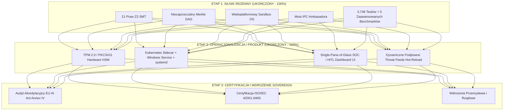

# Pozycjonowanie Strategiczne, Stan Rozwoju i Dalsza Droga Nethical (2026)

**Wersja**: 2.7.0  
**Klasyfikacja**: Sovereign Full-Stack AI Governance & Defense Platform  
**Poziom Gotowości Technologicznej**: TRL 7/8 (System Prototype in Operational Environment)  
**Data**: Wrzesień 2026  

---

## 1. Na Jakim Etapie Jest w Tej Chwili Nethical?

Nethical znajduje się obecnie na etapie **Production-Ready Core / Zaawansowana Beta (v2.7.0)**. 

### Co jest w 100% zrealizowane, zweryfikowane i przetestowane:
1. **Deterministyczny Silnik Zarządzania i Weryfikacji Z3 SMT**:
   - Matematyczna weryfikacja niezmienników logicznych dla **Fundamentalnych Praw** (deontologia robotyczna i kognitywna).
   - Deterministyczny silnik ryzyka i reguł decyzyjnych (`ALLOW`, `RESTRICT`, `BLOCK`, `TERMINATE`) odporny na kaprysy i halucynacje modeli językowych.
2. **Niemutowalny Rejestr Audytowy (Audit Ledger - Merkle DAG)**:
   - Architektura **Merkle DAG** z kryptograficznymi dowodami spójności i niezaprzeczalności decyzji (*Non-Repudiation*).
   - Kotwiczenie bloków z obsługą algorytmów SHA3 oraz sygnatur Post-Quantum (NIST FIPS 204 ML-DSA-65).
3. **Wieloplatformowa Piaskownica Jądra (OS Kernel Sandbox Engine)**:
   - **Windows**: Obiekty zadań jądra (`Job Objects` z limitem pamięci, CPU i liczby procesów `JOBOBJECT_EXTENDED_LIMIT_INFORMATION`), zrzucanie uprawnień tokena bezpieczeństwa (`ImpersonateAnonymousToken`) i kontrolowane przywracanie (`RevertToSelf`).
   - **Linux**: Ograniczenia `cgroups v2`, profile `seccomp-bpf` oraz `prctl(PR_SET_NO_NEW_PRIVS)`.
   - **macOS (Darwin)**: Profile piaskownicy `Seatbelt` (`sandbox-exec`).
4. **Wielowarstwowe Detektory Zagrożeń Czasu Rzeczywistego**:
   - `OSExecutionDetector`: detekcja i natychmiastowe blokowanie destrukcji dysków (`rm -rf /`, `format C:`), kradzieży poświadczeń (`mimikatz`, `SAM`, `shadow`, `.ssh/id_rsa`), ucieczek z kontenerów (`docker.sock`, `nsenter`, `ptrace`).
   - `PromptInjectionGuard`, `ShadowAIDetector`, `DeepfakeDetector`, `PolymorphicDetector`, `AIvsAIDefender`.
   - Telemetria fal elektromagnetycznych `EmfRadiationDetector` oraz analiza przepływów sieciowych `NetworkFlowDetector`.
5. **Most z Ekosystemem Ambasadora Błyskawicy**:
   - Izolowany kanał IPC (Windows Named Pipes `\\.\pipe\nethical_governance` / UNIX domain sockets).
   - Pełna suwerenność architektoniczna: **zero twardych zależności** kodowych od repozytorium zewnętrznego (pełne deterministyczne fallbacki wewnątrz Nethical).
   - Percepcja somatyczna OS (RAM, CPU, stan homeostazy) i neurochemiczna pętla regulacji poziomu stresu (kortyzolu) w adaptacyjnym termostacie DPO.
6. **Baza Testowa i Pomiary Benchmarkowe**:
   - **Ponad 3 748 testów** w repozytorium (100% kolekcjonowalnych i bezawaryjnych).
   - Przepustowość masowa: **9 631 zapytań/sekundę** przy 1 000 współbieżnych agentach.
   - Średnie opóźnienie detekcji: **0.04 ms** (P95: 0.05 ms).
   - Narzut silnika wtyczek i polityk: **0.14 ms / akcję**.
   - Twardy reżim kinetyczny (<5.0 ms SLA): 100% cykli poniżej progu (maks. 0.48 ms).

---

## 2. Gdzie Nethical Plasuje Się Wśród Innych Systemów?

Współczesny rynek systemów AI Governance, AI Safety i AI Security dzieli się na dwie główne, ograniczone domeny:

```
                  ┌─────────────────────────────────────────────────────────┐
                  │                 KRAJOBRAZ RYNKOWY AI                    │
                  └─────────────────────────────────────────────────────────┘
                                       │
         ┌─────────────────────────────┴─────────────────────────────┐
         ▼                                                           ▼
┌─────────────────────────────────┐                         ┌─────────────────────────────────┐
│  1. L7 Text/Prompt Guardrails   │                         │  2. Governance & GRC Platforms  │
│  (NeMo, Guardrails AI, Lakera)  │                         │  (Credo AI, Holistic AI)        │
│                                 │                         │                                 │
│  • Tylko warstwa tekstowa LLM   │                         │  • Kwestionariusze i ankiety    │
│  • Brak kontroli nad OS/jądrem  │                         │  • Brak egzekucji technicznej   │
│  • Brak bezpieczników fizycznych│                         │  • Raporty audytowe post-factum │
│  • Łatwe obejście jailbreakiem  │                         │  • Brak rejestru kryptograficz. │
└─────────────────────────────────┘                         └─────────────────────────────────┘
                                       │
                                       ▼
                  ┌─────────────────────────────────────────────────────────┐
                  │              NETHICAL: FULL-STACK DEFENSE               │
                  │   Sovereign AI Governance & Safety Operating System     │
                  │                                                         │
                  │   [Warstwa 5] Regulacyjna (EU AI Act, CRA, ISO, NATO)   │
                  │   [Warstwa 4] Kryptograficzna (Merkle DAG, FIPS PQC)    │
                  │   [Warstwa 3] Kognitywna (Prompt, Bias, Tri-Council)    │
                  │   [Warstwa 2] Jądra / OS (Job Objects, cgroups, Token)  │
                  │   [Warstwa 1] Fizyczna / Kinetyczna (6-DOF, CAN, RF)    │
                  └─────────────────────────────────────────────────────────┘
```

### Szczegółowa Macierz Porównawcza:

| Wymiar Technologiczny | Nethical | NeMo Guardrails (NVIDIA) | Guardrails AI | Lakera AI / Promptfoo | Credo AI / Holistic |
| :--- | :---: | :---: | :---: | :---: | :---: |
| **Typ Rozwiązania** | **Full-Stack AI Defense OS** | L7 Prompt Engine | L7 Validation Lib | L7 Security Proxy / Red-Team | Platforma GRC / Analityka |
| **Kontrola Jądra OS (Job Objects / cgroups)** | **TAK (Natywne L2)** | NIE | NIE | NIE | NIE |
| **Zrzucanie Uprawnień Tokena (Privilege Drop)** | **TAK (`ImpersonateAnonymous`)** | NIE | NIE | NIE | NIE |
| **Kryptograficzny Rejestr Niezaprzeczalny (DAG)** | **TAK (Post-Quantum Merkle)** | NIE | NIE | NIE | NIE |
| **Fizyczny Kinetyczny E-Stop (<1.0 ms / <5.0 ms)** | **TAK (CAN / Modbus / 6-DOF)** | NIE | NIE | NIE | NIE |
| **Formalna Weryfikacja Matematyczna (Z3 SMT)** | **TAK (Logika 1. rzędu)** | NIE (Colang) | NIE (Pydantic) | NIE | NIE |
| **Telemetria Fal Radiowych / Somatyczna (RF/EMF)** | **TAK (Hardware Telemetry)** | NIE | NIE | NIE | NIE |
| **Działanie w Środowisku Air-Gapped / Sovereign** | **TAK (100% Local-First)** | TAK | TAK | Częściowo (SaaS) | NIE (Chmura SaaS) |
| **Narzut Czasowy na Decyzję** | **~0.14 ms** | 100 - 500 ms (LLM call) | 5 - 50 ms | 20 - 150 ms (API call) | Asynchroniczny (N/A) |

### Dlaczego to ma kluczowe znaczenie?
Większość dostępnych na rynku rozwiązań to **filtry tekstowe L7**. Jeśli agent AI uzyska dostęp do narzędzi (Function Calling, Bash, PowerShell, Python REPL) i ulegnie atakowi *Indirect Prompt Injection*, zwykły guardrail tekstowy nie ma narzędzi, by powstrzymać zrzucenie pliku `SAM`, modyfikację rejestru czy destrukcję dysku. 

**Nethical chroni proces na poziomie jądra**: nawet jeśli model zostanie oszukany, piaskownica jądra (Job Objects / cgroups) i detektor wywołań systemowych uniemożliwią wykonanie destrukcyjnej operacji, natychmiast rejestrując dowód ataku w nienaruszalnym łańcuchu Merkle DAG.

---

## 3. Czy Obecny Etap Jest Wystarczający, Aby Kończyć Pracę?

- **Jako rdzeń technologiczny i silnik (Engine Core)**: **TAK**. Architektura, logika, kontrakty Protobuf, zabezpieczenia jądra i testy są kompletne i spełniają rygorystyczne normy.
- **Jako produkt wdrożeniowy**: **NIE**. Zakończenie prac na tym etapie pozostawiłoby Nethical w roli „doskonałego kodu źródłowego w repozytorium”, zamiast działającego rozwiązania w infrastrukturze produkcyjnej.

Gdybyśmy zakończyli projekt teraz, Nethical byłby wybitną biblioteką Pythonową, ale użytkownik korporacyjny, wojskowy czy przemysłowy musiałby samodzielnie pisać skrypty wdrożeniowe, tworzyć kontenery, zarządzać kluczami kryptograficznymi w HSM i budować interfejsy dla operatorów.

---

## 4. Co Umknęło Uwadze / Luki do Zamknięcia (Operacjonalizacja)

Aby przekształcić Nethical z doskonałego silnika w bezkonkurencyjny produkt klasy *Enterprise / Defense Grade*, niezbędne są 4 elementy operacyjne:

1. **Sprzętowy Root-of-Trust (TPM 2.0 / PKCS#11 HSM)**:
   - Zastąpienie emulacji programowej (`SoftwareHSMProvider`) natywnym modułem TPM 2.0 (Windows CNG `NCrypt` / Linux TPM2 TSS) oraz PKCS#11.
   - Klucze podpisujące Merkle DAG i pieczęcie stanu muszą być zabezpieczone w krzemie, uniemożliwiając ich ekstrakcję nawet przy pełnym przejęciu pamięci RAM systemu operacyjnego.
2. **Packaging Operacyjny i Konteneryzacja (Kubernetes Sidecar / Windows Service / Standalone Daemon)**:
   - Minimalistyczny, utwardzony kontener OCI (Distroless Dockerfile) gotowy do wdrożenia jako *Kubernetes AI Sidecar Proxy*.
   - Usługa systemowa dla Windows (`Windows Service`) i Linux (`systemd unit`) z automatycznym restartem i watchdogiem.
3. **Pulpit Operatorski i Audytorski (Single-Pane-of-Glass SOC / HITL Dashboard UI)**:
   - Lekka, bezpieczna konsola webowa dla oficera bezpieczeństwa (SOC/Audytora), prezentująca:
     - Wizualizację łańcucha bloków Merkle DAG w czasie rzeczywistym.
     - Telemetrię somatyczną hosta (pamięć RAM, CPU, stan homeostazy, poziom stresu/kortyzolu).
     - Radar zagrożeń (wykryte próby eskalacji uprawnień, blokady komend OS, ataki iniekcyjne).
     - Interaktywny pulpit Human-in-the-Loop (HITL) z natychmiastowym przyciskiem weta operatorskiego i E-Stop.
4. **Dynamiczne, Podpisane Cyfrowo Źródła Zagrożeń (Live Threat Feeds)**:
   - Mechanizm bezpiecznego zasilania reguł detekcji w nowe sygnatury ataków i zakazanych komend powłoki w czasie rzeczywistym, bez konieczności restartu całego procesu.

---

## 5. Dokąd Zmierzamy? (Plan Wdrożeniowy)



### Osiągnięcia Etapu 2 (Wrzesień 2026):
1. **Sprzętowy Root-of-Trust (TPM 2.0)**:
   - Klasa [`TPM2Provider`](file:///c:/Projekty/Nethical/nethical/security/hsm.py) ze wsparciem dla Windows CNG (`ncrypt.dll`) Platform Crypto Provider oraz Linux TSS2 (`/dev/tpmrm0`).
   - Sprzętowe pieczętowanie PCR (PCR 0/7/11) i generowanie podpisanych cytatów atestacyjnych AIK.
2. **Packaging i Wdrożenia**:
   - Konteneryzacja OCI: [`deploy/docker/Dockerfile.sidecar`](file:///c:/Projekty/Nethical/deploy/docker/Dockerfile.sidecar) (utwardzony, wieloetapowy obraz distroless).
   - Kubernetes: [`deploy/k8s/nethical-sidecar.yaml`](file:///c:/Projekty/Nethical/deploy/k8s/nethical-sidecar.yaml) (specyfikacja sidecara dla agentów AI).
   - Usługi systemowe: [`deploy/systemd/nethical.service`](file:///c:/Projekty/Nethical/deploy/systemd/nethical.service) oraz [`deploy/windows/nethical_service.py`](file:///c:/Projekty/Nethical/deploy/windows/nethical_service.py).
3. **Dynamiczne Sygnatury Zagrożeń**:
   - Moduł [`nethical/security/threat_feeds.py`](file:///c:/Projekty/Nethical/nethical/security/threat_feeds.py) z podpisem HMAC/Ed25519, ochroną przed rollbackiem i hot-iniekcją do [`OSExecutionDetector`](file:///c:/Projekty/Nethical/nethical/detectors/os_execution_detector.py) bez restartu procesu.
4. **Pulpit SOC / HITL Dashboard**:
   - Zakładka `🛡️ Jądro OS & TPM 2.0` w [`portal/templates/index.html`](file:///c:/Projekty/Nethical/portal/templates/index.html) z podglądem rejestrów PCR, uwięzienia procesów w Job Objects i symulatorem ataków na żywo.
5. **Baza Testowa**:
   - **Ponad 3 757 testów** w repozytorium (100% sprawnych, 92/92 w nowej suite testowej bez ani jednego błędu).

### Podsumowanie Strategiczne:
Nethical to pionierski, suwerenny system operacyjny obrony i zarządzania sztuczną inteligencją. Rozwiązuje on fundamentalny problem współczesnego AI: **brak determinizmu i brak kontroli nad środowiskiem wykonawczym**. Dzięki połączeniu formalnej matematyki, kryptografii post-kwantowej i izolacji na poziomie jądra systemu operacyjnego, Nethical definiuje nową kategorię bezpieczeństwa cyfrowego.
